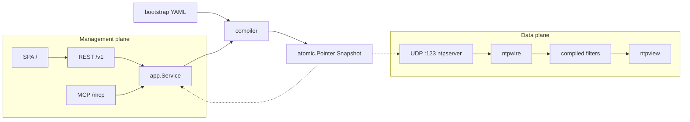
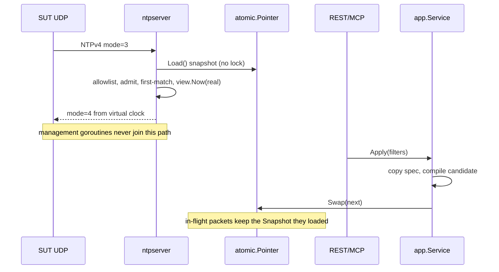
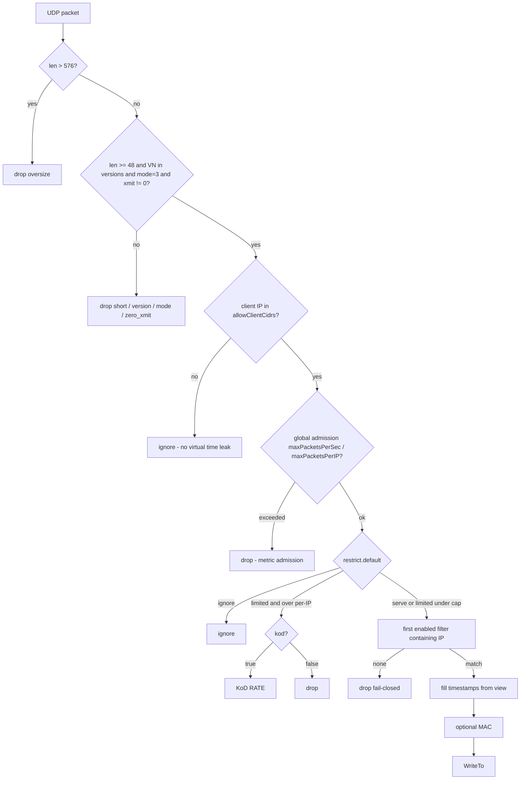

# LabNTP — Per-Client Virtual Time Appliance

| Field | Value |
|---|---|
| **Title** | LabNTP implementation design (`hilather/go-lab-ntp`) |
| **Author** | Keystone / LabNTP |
| **Date** | 2026-08-30 |
| **Status** | Draft |
| **Target repo** | `/home/brewerm/git/go-lab-ntp` (greenfield; currently `README.md` only) |
| **GitHub** | `hilather/go-lab-ntp` |
| **API group** | `labntp.dev/v1alpha1` |
| **License** | Apache-2.0 |
| **Source of truth** | [mcp-integration-lab#17](https://github.com/hilather/mcp-integration-lab/issues/17) |
| **Scheduling** | Not scheduled. Helm does not merge this. Must not block labgraph, fixture packs, mcp-integration-lab #12, or LabMITM UI. |

This document is the implementation plan for **this repo**. The integrator (`mcp-integration-lab`) is last and must not own product logic. Integrator contracts are specified so a later pin can land without reverse-engineering the appliance.

---

## Overview

Lab appliances inherit the VM clock. Scratch images do not run timesyncd. A chrony sidecar nobody queries is dead weight. QA still needs **controllable virtual time per client** so one tester can skew Kerberos (~5 min), jump a cert into not-yet-valid / expired, or drift a TOTP step **without** moving the lab host clock or colliding with another tester on the same compose graph.

NTP is the **wire** real SUTs already speak (VMs, network gear, Jenkins agents, laptops). It is not the product. The product is a lab-owned time source with **per-IP views**. LabNTP answers NTPv4 (and v3) from those views. It never calls `settimeofday` / `clock_settime` / `adjtimex` on the box or on sibling appliances.

LabNTP is a new first-party Go scratch appliance in the LabDNS / LabMail / LabMITM family: single-process plan/apply, fail-closed YAML (`KnownFields`), secrets as file refs, two planes (UDP data plane independent of REST/MCP/SPA), official MCP SDK, static bearer, SPA cookie+CSRF. Not a shared `labappliance` module. Not MCP-by-proxying-REST. Not Python/chrony wrapped as the appliance. Not flattened onto LabLDAP or TacLab.

---

## Background & Motivation

### Current state

- Lab compose graphs share one VM clock.
- Scratch appliances (`USER 65532`, no systemd) do not NTP-query and must stay on real time in v1.
- A host-wide clock step poisons Kerberos, TLS, TOTP, and logs for **every** tester and every sibling service.
- Classic repro is **SUT clock wrong, lab services real**: filter on the SUT source IP. Inverse (lab service clock wrong) is later, and only if that process actually queries NTP. v1 does not add a control-plane time bus into LabLDAP/TacLab.

### Pain points

1. Two testers on one lab cannot independently enter a 5-minute Kerberos skew window.
2. Cert not-before / expiry replications require either waiting or stepping the host.
3. TOTP 30s/60s window tests contaminate other sessions.
4. Wrapping chrony/ntpd would pull Python, a host daemon, and a single global clock — the opposite of per-IP views.

### Family pattern this design copies

| Concern | Sibling source of truth |
|---|---|
| UDP data plane independent of management | [`go-lab-dns/internal/dnsserver`](file:///home/brewerm/git/go-lab-dns/internal/dnsserver/udp.go), [`server.go`](file:///home/brewerm/git/go-lab-dns/internal/dnsserver/server.go); invariant 1 in [`docs/01-architecture.md`](file:///home/brewerm/git/go-lab-dns/docs/01-architecture.md) |
| First-party wire codec (no leaked library types) | [`go-lab-dns/internal/dnswire`](file:///home/brewerm/git/go-lab-dns/internal/dnswire/) — NTP is simpler (fixed 48-byte header); do **not** import an NTP library |
| Host port collision class | LabDNS host `10053` ← container `5353` ([`docker-compose.yaml`](file:///home/brewerm/git/mcp-integration-lab/docker-compose.yaml) lines 33–34). LabNTP host **`10123/udp`**, container **`:123`** |
| Privileged-port preflight | TacLab 49 pattern: `EACCES` is not occupied — [`mcp-integration-lab/internal/lab/ports.go`](file:///home/brewerm/git/mcp-integration-lab/internal/lab/ports.go) `isPermissionDenied` |
| `--management-listen` default **off** | [`go-lab-mitmproxy/cmd/labmitm/serve.go`](file:///home/brewerm/git/go-lab-mitmproxy/cmd/labmitm/serve.go) `mgmtListen := fs.String("management-listen", "off", …)`; compose must pass the flag ([LabMITM `docs/14-integration-lab.md`](file:///home/brewerm/git/go-lab-mitmproxy/docs/14-integration-lab.md); this repo’s BOM is `docs/13-integration-lab.md`) |
| KnownFields fail-closed YAML | [`go-lab-mitmproxy/internal/config/decode.go`](file:///home/brewerm/git/go-lab-mitmproxy/internal/config/decode.go) `dec.KnownFields(true)` |
| One capability registry; MCP is not a REST proxy | [`go-lab-mitmproxy/internal/capabilities/catalog.go`](file:///home/brewerm/git/go-lab-mitmproxy/internal/capabilities/catalog.go), [`internal/app/service.go`](file:///home/brewerm/git/go-lab-mitmproxy/internal/app/service.go) |
| MCP protocol + SDK | Official `github.com/modelcontextprotocol/go-sdk v1.7.0`, protocol **`2026-07-28`** ([`go-lab-mitmproxy/internal/control/mcp/server.go`](file:///home/brewerm/git/go-lab-mitmproxy/internal/control/mcp/server.go) `ProtocolVersion`, `SDKModule`, `SDKVersion`) |
| Static bearer; SPA cookie+CSRF; never localStorage tokens | [`go-lab-mitmproxy/internal/auth/session.go`](file:///home/brewerm/git/go-lab-mitmproxy/internal/auth/session.go) (`labmitm_session`, `X-LabMITM-CSRF`); [`web/src/api/storage.ts`](file:///home/brewerm/git/go-lab-mitmproxy/web/src/api/storage.ts) |
| Scratch image, UID 65532, cap_drop ALL | [`go-lab-mitmproxy/Dockerfile`](file:///home/brewerm/git/go-lab-mitmproxy/Dockerfile), [`go-lab-dns/Dockerfile`](file:///home/brewerm/git/go-lab-dns/Dockerfile) |
| Secret files 0o644 for UID 65532 | Integrator AGENTS.md rules 11/12; compose smoke comments |
| Live vs reset-only | LabMITM D51 ([`docs/adr/0008-additive-v1alpha1-11.md`](file:///home/brewerm/git/go-lab-mitmproxy/docs/adr/0008-additive-v1alpha1-11.md)); LabNTP exposes this as first-class `features.list` |
| Atomic immutable snapshot | [`go-lab-dns/internal/snapshot/store.go`](file:///home/brewerm/git/go-lab-dns/internal/snapshot/store.go) `atomic.Pointer` |
| IPv4-mapped IPv6 unmap before CIDR match | [`go-lab-dns/internal/dnsserver/server.go`](file:///home/brewerm/git/go-lab-dns/internal/dnsserver/server.go) `Addr().Unmap()`; [`internal/snapshot/access.go`](file:///home/brewerm/git/go-lab-dns/internal/snapshot/access.go) |
| Token-bucket admission | [`go-lab-dns/internal/dnsserver/ratelimit.go`](file:///home/brewerm/git/go-lab-dns/internal/dnsserver/ratelimit.go) |

---

## Goals & Non-Goals

### Goals (v1)

1. Per-IP first-match filters; enabled default catch-all covering `0.0.0.0/0` **and** `::/0` is required (fail-closed).
2. View modes: `follow-real`, `offset`, `absolute`, `freeze`, `rate` — exact formulas in [Time model](#time-model-per-view).
3. Host clock never moves. Tests prove it.
4. REST `/v1` + MCP `/mcp` + SPA parity on plan/apply/filters/preview/queries/features via one `app.Service`.
5. Fail-closed YAML (`KnownFields(true)`); unknown fields reject; omit-style unknown fields reject.
6. Secrets are file refs, never inline (bearer tokens, NTP symmetric keys, future NTS certs).
7. Data plane keeps answering if REST/MCP/UI is slow or unbound.
8. Host publish default **10123/udp**; privileged host **123** is profile opt-in.
9. NTPv4 and NTPv3 unicast server (SNTP clients included). IPv4 + IPv6.
10. Overlap warning on plan; NAT-collision documented.

### Non-goals (v1)

- Wrapping chrony / ntpd / systemd-timesyncd.
- Setting sibling container clocks or teaching scratch appliances to NTP-query.
- NTP pool / anycast / peering / manycast / broadcast / multicast.
- Full NTS (schema key exists, `enabled: false`, enabling is rejected until a later ADR).
- PTP / IEEE 1588.
- Using LabNTP as a production time source.
- IPv4-only (IPv6 filters are in v1).
- Integrator-owned time logic.
- Default host publish on UDP/123.
- NTP control protocol (mode 7), symmetric-active/passive (modes 1/2), broadcast client (mode 6).
- Matching on NTP MAC / key id (later; v1 is IP/CIDR only).
- A control-plane time bus into LabLDAP/TacLab.
- Blocking labgraph, fixture packs, mcp-integration-lab #12, or LabMITM UI.

### Explicitly deferred (must not block v1 schema)

Fixture / scenario hooks (labgraph): `client-skew-5m`, `client-skew-10m`, `cert-not-before-minus-1s`, `cert-expired`, `totp-window-drift`, `leap-insert-pending`, `unsync-stratum-16`. `lab_apply_scenario` would include a LabNTP filter patch as a desired-state fragment; **LabNTP still owns its YAML**. Filter names and view fields must remain stable so those fragments can land later without a schema break.

---

## Key Decisions

| ID | Decision | Rationale |
|---|---|---|
| **D1** | New first-party Go module `github.com/hilather/go-lab-ntp`, binary `labntp`, image `labntp:local` / `ghcr.io/hilather/labntp`. Not a LabDNS/LabLDAP/TacLab module. | FR: new repo; family shape; Apache-2.0. |
| **D2** | First-party `internal/ntpwire` codec. **No** NTP library (`beevik/ntp`, `facebook/time`, chrony, ntpd). Direct product deps: `gopkg.in/yaml.v3` (KnownFields) and `github.com/modelcontextprotocol/go-sdk v1.7.0`. The MCP adapter may import the SDK’s already-pinned `github.com/google/jsonschema-go` to relax generated tool-input `required` for ViewSpec zero-defaults (not a third product library; same v0.4.3 pin). | NTP is a 48-byte header; LabDNS already hid wire types in `internal/dnswire`. A library would leak types and invite client-mode discipline we must not do. |
| **D3** | Two planes, one process. UDP NTP goroutine never imports `internal/control` or `internal/web`. `--management-listen` defaults **off** (LabMITM, not LabDNS). | FR; data plane survives unbound/slow management. |
| **D4** | Container NTP listen default `:123`. Image is `USER 65532:65532` + `cap_drop: ALL`. **Integrator compose** restores only `cap_add: [NET_BIND_SERVICE]` so bind-to-123 works. **Default `make test-container` does not** — it uses `--ntp-listen=:1123` and `cap_drop: ALL`. Gated `LABNTP_TEST_NET_BIND=1` proves `:123`+cap. Host map default `10123:123/udp`. `--ntp-listen` overrides for cap-less local runs (e.g. `:1123`). Host UDP/123 is profile opt-in; integrator preflight must not treat `EACCES` as occupied. | FR wants 123 in-container; family forbids root. LabDNS avoided this with 5353; NTP clients speak 123, so the container port stays 123 and the cap is the compose exception, not the smoke default. |
| **D5** | `absolute` is **step-then-follow** at rate 1.0: at apply, virtual clock jumps to the RFC3339 instant and then tracks **monotonic** elapsed time (D22). `freeze` is the stop-clock mode. Explicit `rate: 0` equals freeze-at-epoch-virtual. | FR calls absolute a “step” and gives freeze its own field. Treating absolute as freeze would duplicate modes. |
| **D6** | Filter match is **list order, first enabled wins**. Longest-prefix does **not** win (unlike LabDNS client groups in `internal/snapshot/access.go`). Unmatched packet is **dropped** (no reply). Missing default catch-all fails validate/apply. | Matt: per-host-IP filters; tester `/32` above default `/0` is the intended pattern. |
| **D7** | Packet path: `allowClientCidrs` (global allowlist, ignore) → admission (`maxPacketsPerSec` **global** / `maxPacketsPerIP` per-IP) → `restrict.default` → first-match filter. Outside the allowlist: silent ignore (no leak of virtual time to office NTP). | FR safety knobs. Not a copy of LabDNS `defaultQueryRate` (that is per-source). |
| **D8** | Live apply: filters CRUD, view fields, restrict, admission, allowClientCidrs, query-log size, management HTTP limits. **Reset-only** (Reset rebinds / rereads, not live Apply): listen addresses, `ntp.nts.enabled`, `ntp.symmetricKeys.file`, `spec.auth`. Reset **rebinds NTP and management HTTP** iff the effective listen address (after `--ntp-listen` / `--management-listen` override) changed; bind **new first**, then drain/close old. Unchanged listen does not rebind. Flags always win over YAML on serve **and** Reset. Ready stays **true** on the old socket until the new bind succeeds; Ready=false only if switching management to `off` after the old HTTP server has drained. | LabMITM D51 idea, but LabNTP UDP/HTTP binds are real sockets so Reset must rebind. Not `restart-only`. |
| **D9** | Views are desired-state, not sticky RAM. Reset rereads bootstrap YAML and never writes it. Materialized `epoch` (virtual) appears on GET/export but is not persisted back to the file. | Family GitOps; FR “reset restores bootstrap YAML”. |
| **D10** | Auth: static bearer, SHA-256 digest compare, tokens ≥32 bytes, file refs only, no HTTP Basic. SPA: HttpOnly cookie `labntp_session` + CSRF header `X-LabNTP-CSRF`; in-memory CSRF only; tests forbid localStorage tokens. Management bind requires ≥1 usable token (or listen off). | LabMITM SEC-001. |
| **D11** | MCP pin `2026-07-28`, official SDK v1.7.0, Streamable HTTP `POST /mcp` (`Stateless: true`). `allowLegacyClients` default **false**; lab overlay sets **true** so MCPJungle can register without a LabNTP patch (LabMITM D14/D15). | Family pin; do not ship a lab patch. |
| **D12** | One `app.Service`. REST and MCP are adapters; they never call each other and never implement domain logic. Capability registry is the frozen REST↔MCP table. MCP tools use family prefix **`ntp_*`** (FR’s `labntp_queries_list` is rejected — same pattern as LabDNS `dns_*`, LabMITM `mitm_*`, LabMail `mail_*`). Resources stay `labntp://…`. `features.list` ids are frozen in `api/` goldens in the PR that adds the handler (PR 9), not grown in the UI PR. | LabDNS/LabMITM/LabMail ADR 0004; avoid a later MCPJungle doc resurrecting `labntp_*`. |
| **D13** | YAML API is `labntp.dev/v1alpha1` / kind `LabNTP`. **One path each (KnownFields cannot alias):** `spec.auth` (FR; not `spec.management.auth`); `spec.ui.enabled` (LabMITM/LabMail; not `spec.management.ui`); `spec.management.allowedOrigins` (LabDNS spelling; reject LabMITM `originAllowlist`); `spec.management.mcp.allowLegacyClients`; `spec.management.{bodyLimit,requestsPerSecond,burst,maxConcurrent}`. | FR YAML is the operator contract for auth; UI/origins follow the sibling that already has a SPA at `spec.ui`. |
| **D14** | Never set the **LabNTP process / lab host** clock. SUTs *will* step *their* clocks; that is the product. Gate is AST/`go/packages` scan in `TestNoClockSetSyscalls`: (1) selector names `Settimeofday`, `ClockSettime`, `Adjtimex`, `ClockAdjtime`, `Adjtime` (any package); (2) **string-literal arguments** of `exec.Command` / `exec.CommandContext` equal to `date`, `hwclock`, `chronyc`, `ntpd`, `timedatectl` (basename after last `/`). Do **not** match identifier `date`/`Date` (`time.Date` is required for era constants) or identifier `Command` alone. Runtime test compares `\|ΔCLOCK_REALTIME − ΔCLOCK_MONOTONIC\| < 50ms` across a packet flood. `unix.ClockGettime` is allowed **only** in `_test.go` to *read* clocks. | FR invariant. Naive `date` identifier scan false-positives `time.Date`. |
| **D15** | Dual-stack UDP. `net.ListenPacket("udp", addr)`; client IP is `netip.Addr.Unmap()` before CIDR match. IPv4-mapped IPv6 must match IPv4 prefixes (LabDNS access test). v1 does **not** inspect packet destination (no `IP_PKTINFO`); unicast bind + no `IP_ADD_MEMBERSHIP` is the multicast/broadcast guard. | FR: IPv6 filters in v1. `ReadFrom` does not return dest. |
| **D16** | Operator UI ships after the data/control-plane PRs. Mira reviews the SPA. First UI: filter table, enable/disable, preview-an-IP, leap/stratum chips, live vs reset-only labeled. No JS heap browser for logs beyond the query ring. | FR. Implemented in PR 13; chrome inspector (list-order + mode fields PUT already accepts) is specified in [docs/12-web-ui.md](12-web-ui.md). See [docs/remaining-work.md](remaining-work.md) D29–D38. Do not rewrite D1–D28. |
| **D17** | Integrator is out-of-repo follow-up. This repo publishes overlay BOM under `examples/` and `docs/13-integration-lab.md` (tighter pack than LabMITM’s `docs/14-integration-lab.md`). No product logic in `mcp-integration-lab`. Locked ports: `LABNTP_NTP_PORT=10123` (FR default; native host 123 remains opt-in — do not silently “fix” to IANA 123), `LABNTP_REST_PORT=18123`. | FR “integrator last”. |
| **D18** | Go 1.26, CI pin `GO_VERSION=1.26.6`, `golang:1.26.6-alpine` → `scratch`, Node 22.14.0 for the SPA (when UI lands). | Family pins. |
| **D19** | YAML `epoch` is **optional virtual time** (RFC3339). There is **no** user `epochReal` field in v1. On compile of `mode: rate`: if `epoch` is set, `epochVirtual = parse(epoch)`; if omitted on a **new** view, `epochVirtual = compileClock` (wall UTC of compile, i.e. “now”). `epochMono` / `epochWall` are compile-time internals only (no user `epochReal`). Live apply that does not change `rate` or YAML `epoch` keeps the previous pair (no jump). Changing `rate` re-anchors: `epochVirtual = served(compileClock)` under the **old** view, then the new rate runs from there. Changing YAML `epoch` uses the new virtual anchor. | FR “epoch = when this view was applied” is the omitted-epoch case. Explicit `epoch` is how “start at 2035 and run 2×” works without a second mode. |
| **D20** | Presence types: `ViewSpec.Rate *float64`, `MinPoll *int`, `MaxPoll *int`. Omitted `rate` on non-rate modes is unset (ignored); omitted `rate` on `mode: rate` fails validate; explicit `rate: 0` is legal. Present `rate` must be finite and `|rate| ≤ 100`. Omitted minpoll/maxpoll means “echo client poll”; explicit `0` is log2(1s) and is **not** treated as omitted; if both set, `minpoll <= maxpoll` and each in `[-6, 17]`. Cross-mode fields are rejected by the [forbidden-field matrix](#mode-formulas). | Go/YAML zero `float64` is `0`, which is a legal rate. Poll 0 is a legal NTP poll. Inf/NaN and huge rates overflow `time.Duration`. |
| **D21** | Symmetric MAC is **ntpd/chrony concatenation**, not RFC 2104 HMAC: `digest = ALG(key \|\| 48-byte header)` for `MD5` / `SHA1` / `SHA256`. Trailer is `keyid_be32 \|\| digest` (16/20/32 bytes). MD5 is allowed in v1 because lab `ntp.keys` files still use it; default overlay omits keys. | SUTs (ntpd, chronyc, W32Time) disagree with HMAC-SHA256; keyed mode fail-closed on a bad digest would break the lab. |
| **D22** | `Clock.Now()` returns `time.Now()` **without** `.UTC()` so the monotonic reading is kept. `follow-real` / `offset` track **wall UTC** on purpose (a host timesyncd step moves those views with the VM, matching “virtual time vs the VM clock”). `absolute` / `rate` elapsed uses `t.Sub(epochMono)` (monotonic). Convert to UTC only at NTP encode. | `.UTC()` strips monotonic; wall subtraction jumps every rate/absolute view when the VM NTP steps. |
| **D23** | `allowClientCidrs`: **omitted or YAML `null`** (`nil` slice) materializes `["0.0.0.0/0","::/0"]` and validate **warns**. **Empty list** (`allowClientCidrs: []`, non-nil) is deny-all. Overlay **must** set lab subnet + `127.0.0.0/8` + `::1/128`. | Distinguishing omitted vs empty is possible with `[]string` in yaml.v3; `null` and omitted both decode as nil. |
| **D24** | Host-publish per-IP isolation requires **source-preserving UDP**. Docker `userland-proxy` (default true on many daemons) SNATs host-published UDP so every laptop/VM hitting `${LAB_PUBLIC_HOST}:10123` appears as one bridge IP. Compose-network sources (`labntp:123`) and `views.preview` remain reliable without that. Integrator AGENTS.md already documents `userland-proxy: false` or macvlan; this repo’s checkdocs must require the same phrase. Do not add a Go userland-proxy probe here. | mcp-integration-lab AGENTS.md rule (LabNTP not in compose yet). FR host 10123 stays the **default**, not merely an “escape” from native 123. |
| **D25** | Served NTP timestamps are clamped to **era 0 start … era 1 end (exclusive)**: `[1900-01-01T00:00:00Z, 2172-03-15T12:56:32Z)` = `1900-01-01 UTC + 2^33` seconds. Views that would encode outside clamp (and plan **warns**). Pre-1900 is **not** well-defined on the wire (no era field). Negative `rate` rewind that hits the floor stays at the floor. | 2035 cert fixture is era 0. Era 0 end is `2036-02-07T06:28:16Z`; era 1 exclusive end is six hours later than 06:56:32. |
| **D26** | UDP read cap `MaxUDPSize = 576` bytes (NTP typical / IPv4 minimum datagram). `len < 48` → `short`; `len > 576` → `oversize` drop (no reply). With keys off, a packet `48 < n ≤ 576` strips trailing bytes and still answers SNTP. With keys on, length must be exactly `48+4+digestLen`. | Uncapped reads are a cheap CPU/amplification path. LabDNS has `MaxUDPSize`. |
| **D27** | In-flight NTP handlers default **1024** (`ntpserver.DefaultMaxInflight`), matching LabDNS `DefaultMaxInflight`, not 256. `maxPacketsPerSec` default 256 is a **process-global** token bucket; `maxPacketsPerIP` default 32 is per unmapped IP. | Review correction: LabDNS 256 is per-source QPS (`allowQuery` keyed by IP). |
| **D28** | YAML view wire names keep the FR spellings `minpoll`, `maxpoll`, `refid` (not camelCase `minPoll`/`refID`). KnownFields rejects the camelCase forms. ADR 0003 and the normative YAML comment this exception. | One spelling. LabMITM muscle memory would otherwise silently fail. |

---

## Proposed Design

### Process and container model

One process, one container, no persistent volume, read-only bootstrap:

```text
                    read-only bootstrap YAML
                    + token file + optional ntp.keys
                              |
                    +---------------------+
SUT / tester -----> |      LabNTP         |   never settimeofday
 UDP/123 NTPv3/v4   |                     |   never query a pool
 (unicast only)     |  atomic snapshot    |
                    |  per-IP view clock  |
                    +----------+----------+
                               |
                  management network only
              REST /v1 + MCP /mcp + SPA /
                               |
                       humans and agents
```



**Ready** = NTP UDP bound + snapshot installed + (management bound **or** `--management-listen=off`). Ready is not “an NTP client could sync.”

**Live** = process up (NTP bind may still be in progress).

### Package layout

Module: `github.com/hilather/go-lab-ntp`

```text
cmd/labntp/                 # CLI: serve, validate, canonicalize, query, healthcheck, version, mcp-stdio
internal/
  app/                      # Service interface, plan/apply/reset, preview, filter CRUD
  audit/                    # bounded ring (management mutations)
  auth/                     # bearer verifier, session cookie+CSRF, scopes
  buildinfo/                # version, commit, MCP protocol constant
  capabilities/             # frozen REST↔MCP catalog
  compiler/                 # Normalize+Validate+compile Snapshot
  config/                   # decode KnownFields, duration, load, export, revision hash
  control/mcp/              # official SDK adapter; no domain logic
  control/rest/             # /v1 adapter; problem+json; no domain logic
  domainerr/                # catalog codes, field violations
  model/                    # State/Spec/Filter/View/Operation — no wire types
  ntpkeys/                  # parse symmetric key file; never logs secrets
  ntpview/                  # virtual clock math (pure; injectable Clock)
  ntpserver/                # UDP listen, admission, dual-stack, KoD
  ntpwire/                  # 48-byte parse/encode, timestamps, MAC, KoD
  observability/            # slog JSON, OpenMetrics (hand-rolled, no prometheus client)
  querylog/                 # last-N ring {clientIP, filter, servedTime, leap, mode}
  snapshot/                 # immutable Snapshot + atomic Store
  testutil/                 # fake clock, packet helpers
  web/                      # go:embed of web/dist (stub until UI PR)
web/                        # React/TS + Vite SPA (PR-13; Mira reviews)
api/
  capabilities/v1.json      # generated
  openapi/v1.json           # generated
  mcp/v1.json               # generated
  metrics/v1alpha1.json     # generated
  jsonschema/labntp.dev.v1alpha1.json
testdata/config/{valid,invalid}/
testdata/packets/           # raw NTPv3/v4 fixtures
testdata/keys/
testdata/container/
examples/                   # compose.smoke.yaml + integrator overlay BOM
docs/ + docs/adr/
scripts/{generate,checkdocs,checkchangelog}
tasks/
```

Import fences (enforced by `internal/*/imports_test.go` like LabMITM `internal/web/imports_test.go` and AGENTS.md):

- `internal/ntpserver`, `internal/ntpwire`, `internal/ntpview`, `internal/ntpkeys` **must not** import `internal/control` or `internal/web`.
- `internal/control/rest` and `internal/control/mcp` **must not** import each other; both call `app.Service` only.
- Production code **must not** import `syscall`/`golang.org/x/sys/unix` clock-set identifiers (D14). `unix.ClockGettime` is allowed **only** in `_test.go` to *read* `CLOCK_REALTIME` / `CLOCK_MONOTONIC`.
- `cmd/labntp/query.go` (SNTP **client**) **must not** be imported by `internal/ntpserver` or the serve path; it is a CLI-only helper.

### CLI

Follow LabMITM [`cmd/labmitm/main.go`](file:///home/brewerm/git/go-lab-mitmproxy/cmd/labmitm/main.go) / [`cli.go`](file:///home/brewerm/git/go-lab-mitmproxy/cmd/labmitm/cli.go):

```text
labntp <command>

  version          print build + MCP protocol
  help             usage
  validate         fail-closed YAML (--config)
  canonicalize     emit canonical spec (--config, --format yaml|json)
  serve            bind NTP; management only if --management-listen is an address
  query            SNTP client for smoke (never used by the server)
  healthcheck      GET --url (image HEALTHCHECK)
  mcp-stdio        developer adapter; --token-file required (not image entrypoint)
```

`serve` flags (LabMITM-shaped):

| Flag | Default | Notes |
|---|---|---|
| `--config` | required | bootstrap path; never written |
| `--ntp-listen` | empty → YAML | override NTP bind |
| `--management-listen` | **`off`** | `off`/`none`/`-` unbound; compose passes `:8088` |
| `--shutdown-timeout` | `5s` | graceful UDP + HTTP |
| `--pid-file` | empty | written after binds |

`--config` is required on validate/canonicalize/serve (same as LabDNS `requireConfigFlag`).

### Concurrency and snapshot



- NTP read loop is one goroutine; each admitted packet is handled on a bounded worker (`MaxInflight`, default **1024**, LabDNS `dnsserver.DefaultMaxInflight`).
- Snapshot load is `atomic.Pointer.Load` — no mutex on the packet path except the rate-limiter map and the query-log ring.
- Query-log insert uses a short mutex; if the lock is not acquired within `100µs`, the log sample is dropped and `labntp_querylog_dropped_total` increments. The packet is still answered.
- Apply/Reset compile a complete candidate, then `Store.Swap`. A packet never sees a half-built filter list.
- Management HTTP runs on `http.Server` in its own goroutines with LabMITM-shaped admission (`bodyLimit` default 1 MiB, `requestsPerSecond` default 32, `burst` default 64, `maxConcurrent` default 256). Slow MCP does not block UDP `ReadFrom`; the HTTP limits exist so a management flood cannot soak CPU/GC into the data plane.

### Listen / dual-stack

```go
// ntpserver binds one dual-stack packet conn by default.
pc, err := net.ListenPacket("udp", addr) // addr e.g. ":123"
```

- `":123"` on Linux is IPv6-unspecified with IPv4-mapped when `net.ipv6.bindv6only=0` (Docker default). Tests bind `:0` and exercise `udp4` + `udp6` clients.
- Client address: `netip.AddrPortFrom(...).Addr().Unmap()` before allowlist and filter match (copy LabDNS `peerFromAddr`).
- `serveMode` is `unicast` only. **No** `IP_ADD_MEMBERSHIP`. v1 does **not** inspect the packet destination address (`net.ListenPacket` `ReadFrom` does not return it; `IP_PKTINFO` / `IPV6_RECVPKTINFO` are out of v1). Unicast bind plus no multicast membership is the broadcast/multicast guard.
- UDP read buffer is `MaxUDPSize` (**576** bytes, D26). Oversize datagrams increment `labntp_packets_total{decision="oversize"}` and are dropped with no reply.
- If YAML address is IPv4-only (`0.0.0.0:123`) or IPv6-only (`[::]:123` with bindv6only), filters for the other family still validate (catch-all required) but cannot match traffic that never arrives.

**UID 65532 vs port 123.** `net.ListenPacket("udp", ":123")` as 65532 returns `EACCES` without `CAP_NET_BIND_SERVICE`. Image stays non-root. Compose smoke and the integrator service restore **only** that cap:

```yaml
user: "65532:65532"
cap_drop: [ALL]
cap_add: [NET_BIND_SERVICE]
security_opt: ["no-new-privileges:true"]
```

Local `go run` without the cap uses `--ntp-listen=:1123`. Unit tests always bind ephemeral ports.

`make test-container` default smoke uses `--ntp-listen=:1123` and `cap_drop: ALL` (family-identical). **Additionally**, `scripts/test-container.sh` has a gated path `LABNTP_TEST_NET_BIND=1` (skip if the runtime cannot grant the cap) that runs the image with `user: 65532:65532`, `cap_drop: ALL`, `cap_add: [NET_BIND_SERVICE]`, `security_opt: ["no-new-privileges:true"]`, `--ntp-listen=:123`, and asserts `ListenPacket` succeeds. Docker must pass `NET_BIND_SERVICE` as an **ambient** capability to a non-root process (dockerd ≥20.10 with default seccomp; document the assumption in `docs/11-deployment.md`). `no-new-privileges:true` is compatible with ambient `NET_BIND_SERVICE` because the cap is already in the bounding set at exec — it does not require a file capability on `/labntp`.

---

## Time model (per view)

A **view** is a virtual clock used **only** when answering that client. Host `Clock.Now()` is the sole real-time input. Served NTP timestamps are derived from the view, never from “set the process clock.”

### Clock interface

```go
// internal/ntpview/clock.go
type Clock interface {
    Now() time.Time // must keep monotonic reading when sourced from time.Now
}

type SystemClock struct{}
func (SystemClock) Now() time.Time { return time.Now() } // NOT .UTC() — D22
```

`Now()` is read twice per packet when needed: `tRecv` at `ReadFrom` return, `tXmit` just before `WriteTo`. Both are converted through the **same** view. Convert to UTC **only** at NTP timestamp encode (`ntpwire.FromTime(t.UTC())`).

Compiled view internals (not YAML):

| Field | Meaning |
|---|---|
| `epochVirtual` | virtual instant the rate/absolute law is anchored to (RFC3339 UTC) |
| `epochMono` | `Clock.Now()` at compile (keeps monotonic) |
| `epochWall` | `epochMono.UTC()` — wall UTC at compile, for export/`hostTime` diffs |

Fake test clocks must implement `Now()` so consecutive calls are comparable with `Sub` (advance a single `time.Time` by `Add`; monotonic is optional in tests if the fake only has wall).

### Mode formulas

Let `t = Clock.Now()`. Wall UTC used in follow-real/offset: `tWall = t.UTC()`. Elapsed used in absolute/rate: `elapsed = t.Sub(epochMono)` (monotonic if both sides have it).

**Forbidden-field matrix** (any present forbidden field fails validate; “present” means the YAML key was set — for `rate`/`minpoll`/`maxpoll` that is pointer non-nil, for `offset`/`jitter`/`rootDelay`/`rootDispersion` that is non-zero duration, for string fields that is non-empty):

| Mode | Required | Forbidden if present | `served(t)` |
|---|---|---|---|
| `follow-real` | — | `offset`, `absolute`, `freezeAt`, `rate`, `epoch` | `tWall` |
| `offset` | — (`offset` may be omitted and materializes `0s`; explicit negative/positive/zero duration all legal) | `absolute`, `freezeAt`, `rate`, `epoch` | `tWall + offset` |
| `absolute` | `absolute` (RFC3339) | `offset`, `freezeAt`, `rate`, `epoch` | `absolute + elapsed` |
| `freeze` | `freezeAt` (RFC3339) | `offset`, `absolute`, `rate`, `epoch` | `freezeAt` |
| `rate` | `rate` key **present** (`*float64` non-nil; finite, including `0` and negative; `\|rate\| ≤ 100`) | `offset`, `absolute`, `freezeAt` | `epochVirtual + saturatingDuration(elapsed * rate)` then D25 clamp |

`offset: 0s` or omitted `offset` on `mode: offset` is legal (equivalent to follow-real; testers can clear a skew without changing mode). `time.Duration` does **not** need a pointer: omitted and `0s` are the same value, and `0` is a valid offset. Bare YAML `offset: 5` is rejected (must be a duration string). `minpoll`/`maxpoll` are legal on every mode when present. Non-zero `offset` on non-offset modes is forbidden.

**Rate / poll bounds (validate):**

- `rate` present but `NaN` or `±Inf` → `invalid_value`.
- `rate` present and `math.Abs(rate) > 100` → `invalid_value` (cap `|rate|` at 100). `100` means 100× real elapsed; a 1 s packet delta is 100 s virtual — well inside `time.Duration`.
- `elapsed * rate` is computed in `float64` seconds then converted with **saturating** `time.Duration` (clamp to `[minDuration, maxDuration]`, about ±290 years) **before** D25 NTP clamp. Overflow must not wrap.
- If both `minpoll` and `maxpoll` are set, require `*minpoll <= *maxpoll`. Each, if set, must be in `[-6, 17]` (NTP poll range).

**Epoch materialization (compiler, at apply/reset/serve compile) — D19:**

- There is **no** user YAML `epochReal`.
- YAML `epoch` is optional **virtual** RFC3339, legal **only** on `mode: rate`.
- Internals at compile:
  - `epochMono = compileClock.Now()`
  - `epochWall = epochMono.UTC()`
  - `epochVirtual`:
    - `follow-real`: `epochWall`
    - `offset`: `epochWall + offset`
    - `absolute`: the `absolute` instant
    - `freeze`: `freezeAt`
    - `rate` + YAML `epoch` set: `parse(epoch)` as UTC
    - `rate` + YAML `epoch` **omitted** on a **new** view (no previous compiled view of this filter name): `epochVirtual = epochWall` (“now”)
- Live apply of an existing `rate` view:
  - `rate` pointer equal and YAML `epoch` unchanged → **keep** previous `epochVirtual` + `epochMono` (no jump).
  - `rate` changed, YAML `epoch` still omitted → re-anchor: `epochVirtual = oldView.Served(compileClock.Now())`, new `epochMono = compileClock.Now()`, then the new rate runs from there (continuous virtual time).
  - YAML `epoch` changed → `epochVirtual = parse(new epoch)`, `epochMono = compileClock.Now()` (explicit jump).

Table tests (PR 4): omitted epoch on new `rate: 2`; explicit `epoch: 2035-01-01T00:00:00Z` + `rate: 2`; live apply unchanged rate/epoch (served continuous); live apply that changes rate (continuous re-anchor); omitted vs `rate: 0` vs `rate: 1` vs missing key.

**`absolute` justification (D5).** FR: “RFC3339 instant the view jumps to (step)”. A step in NTP means the clock discontinuously moves to an instant and then continues. Freeze is the separate “time stops” mode. After apply:

```
served(t) = absolute + t.Sub(epochMono)
```

Export shows both `mode: absolute` and a computed `offsetFromHost` at export time so operators can see the jump.

**`rate: 0` vs `freeze`.** Explicit `rate: 0` ⇒ `served(t) = epochVirtual` (constant). That is freeze-at-apply-time when epoch was omitted, or freeze-at-YAML-epoch when set. `freeze` is freeze-at-an-explicit-instant (`freezeAt`). Validate rejects `mode: freeze` without `freezeAt`, and `mode: rate` with `rate` key omitted. `mode: rate` + `rate: 0` is legal.

**Negative rate** is allowed (rewind tests) subject to `|rate| ≤ 100` and finite. Served time is **clamped** to `[1900-01-01T00:00:00Z, 2172-03-15T12:56:32Z)` (D25) before NTP encode. Do not claim pre-1900 is well-defined on the wire.

**Combining rate with offset/absolute.** v1 modes are exclusive (matrix above). To “start at 2035 and run 2×”, use `mode: rate` with YAML `epoch: 2035-01-01T00:00:00Z` and `rate: 2.0`.

### Advertised quality (not used in the formula)

| YAML field | Wire | Default |
|---|---|---|
| `leap` | LI bits | `none` |
| `stratum` | stratum octet | `2` |
| `refid` | 4-byte refid | `GPS` if stratum 1 else `LOCL` |
| `precision` | signed log2 seconds | `-20` (~1 µs) |
| `rootDelay` | 16.16 NTP short | `0` |
| `rootDispersion` | 16.16 NTP short | `0` |
| `minpoll` / `maxpoll` | poll field (log2 seconds). YAML names are **`minpoll`/`maxpoll`** (FR; not `minPoll`) | omitted (nil) → echo client poll; if set, clamp echoed poll into `[minpoll, maxpoll]` (inclusive). Explicit `0` is log2(1s), **not** omitted |
| `jitter` | extra wander on served timestamps | unset = 0 |

**Jitter (deterministic wander).** White per-packet noise would invert recv/xmit order and flake tests. v1 jitter is a **stable wander** in `[-jitter, +jitter]` over the **host** unix second:

```
h = SHA-256(filterName + "\x00" + le64(generation) + le64(hostUnixSecond))
u = uint64(h[:8]) / 2^64          // [0,1)
delta = (2u - 1) * jitter         // [-jitter, +jitter]
served_jittered = served + delta
```

- `hostUnixSecond` is `Clock.Now().Unix()` (wall, **not** virtual).
- `generation` is `snapshot.Generation` as little-endian uint64.
- `"\x00"` delimiter so `filterName` cannot collide with the numeric suffix.
- The **same** `delta` is added to receive, transmit, and reference timestamps of one packet so `xmit ≥ recv` still holds for `rate ≥ 0`. For `rate < 0`, `xmit ≤ recv` is expected (clock running backwards); do not swap them.

### Leap Indicator mapping

RFC 5905 LI (2 bits):

| YAML `leap` | LI | Meaning |
|---|---|---|
| `none` | `00` (0) | no warning |
| `insert` | `01` (1) | last minute has 61 seconds |
| `delete` | `10` (2) | last minute has 59 seconds |
| `unsync` | `11` (3) | alarm; clock not synchronized |

`unsync` does **not** force stratum 16, but plan **warns** if `leap: unsync` and `stratum != 16`. `stratum: 16` is valid with any leap; clients should stop trusting (fixture `unsync-stratum-16`).

Stratum: 1–15 synchronized, 16 unsynchronized, 0 is **reserved for KoD** (never a normal view). Validate rejects stratum 0 on views.

### Reference ID

- Stratum 1: 1–4 ASCII (padded with NUL): `GPS`, `LOCL`, `INIT`, `PPS`, `ATOM`. Unknown 1–4 byte ASCII is allowed (lab flexibility).
- Stratum 2–15: IPv4 dotted-quad **or** 4 ASCII. If omitted, `LOCL`.
- Stratum 16: `INIT` default.
- KoD: kiss code ASCII (`RATE`, `DENY`, `RSTR`) — not a view field.

### Preview (management read)

`GET /v1/views/preview?ip=` → application/json:

```json
{
  "ip": "10.99.42.20",
  "filter": "tester-a-kerberos",
  "servedTime": "2026-08-30T12:04:00.123456789Z",
  "hostTime": "2026-08-30T12:10:00.123456789Z",
  "mode": "offset",
  "leap": "none",
  "stratum": 1,
  "refid": "LOCL",
  "offsetFromHost": "-6m0s"
}
```

- Does **not** send NTP, does **not** mutate query log (optional: `?record=1` is not in v1).
- Missing `ip` → 400. Unparseable → 400. Not in `allowClientCidrs` → 200 with `"filter":""`, `"servedTime": null`, `"reason":"allowlist"`. No matching filter → 200 with `"reason":"unmatched"` (fail-closed would drop on the wire).
- `offsetFromHost` is `servedTime - hostTime` as a Go duration string.

Status exposes `hostTime` (real) vs per-IP preview. Status itself does not pick an IP.

---

## NTP wire protocol

Package `internal/ntpwire` is the only packet codec. No third-party NTP types escape it.

### NTPv4 48-byte header (RFC 5905 §7.3)

```
 0                   1                   2                   3
 0 1 2 3 4 5 6 7 8 9 0 1 2 3 4 5 6 7 8 9 0 1 2 3 4 5 6 7 8 9 0 1
+-+-+-+-+-+-+-+-+-+-+-+-+-+-+-+-+-+-+-+-+-+-+-+-+-+-+-+-+-+-+-+-+
|LI | VN  |Mode |    Stratum     |     Poll      |   Precision   |
+-+-+-+-+-+-+-+-+-+-+-+-+-+-+-+-+-+-+-+-+-+-+-+-+-+-+-+-+-+-+-+-+
|                         Root Delay                             |
+-+-+-+-+-+-+-+-+-+-+-+-+-+-+-+-+-+-+-+-+-+-+-+-+-+-+-+-+-+-+-+-+
|                       Root Dispersion                          |
+-+-+-+-+-+-+-+-+-+-+-+-+-+-+-+-+-+-+-+-+-+-+-+-+-+-+-+-+-+-+-+-+
|                          Reference ID                          |
+-+-+-+-+-+-+-+-+-+-+-+-+-+-+-+-+-+-+-+-+-+-+-+-+-+-+-+-+-+-+-+-+
|                                                               |
+                     Reference Timestamp (64)                   +
|                                                               |
+-+-+-+-+-+-+-+-+-+-+-+-+-+-+-+-+-+-+-+-+-+-+-+-+-+-+-+-+-+-+-+-+
|                                                               |
+                      Origin Timestamp (64)                     +
|                                                               |
+-+-+-+-+-+-+-+-+-+-+-+-+-+-+-+-+-+-+-+-+-+-+-+-+-+-+-+-+-+-+-+-+
|                                                               |
+                      Receive Timestamp (64)                    +
|                                                               |
+-+-+-+-+-+-+-+-+-+-+-+-+-+-+-+-+-+-+-+-+-+-+-+-+-+-+-+-+-+-+-+-+
|                                                               |
+                      Transmit Timestamp (64)                   +
|                                                               |
+-+-+-+-+-+-+-+-+-+-+-+-+-+-+-+-+-+-+-+-+-+-+-+-+-+-+-+-+-+-+-+-+
```

Go types (no padding; encode via `binary.BigEndian`):

```go
const PacketSize = 48

type Packet struct {
    LI        uint8  // 0..3
    VN        uint8  // 3 or 4
    Mode      uint8  // 3 client / 4 server / 5 broadcast (dropped)
    Stratum   uint8
    Poll      int8
    Precision int8
    RootDelay int32  // signed 16.16 seconds
    RootDisp  uint32 // unsigned 16.16 seconds
    RefID     [4]byte
    RefTime   Timestamp
    OrgTime   Timestamp // originate
    RecTime   Timestamp // receive
    XmtTime   Timestamp // transmit
}

type Timestamp struct {
    Seconds  uint32 // seconds since 1900-01-01 UTC, era-truncated
    Fraction uint32 // 1/2^32 of a second
}

const ntpUnixDelta = 2208988800 // 1970-1900 seconds (era 0)
```

Header octet 0: `(LI << 6) | (VN << 3) | Mode`.

### NTPv3 (RFC 1305) differences that matter for SNTP

| Topic | v3 | v4 | LabNTP v1 |
|---|---|---|---|
| Header size | 48 | 48 | same codec |
| VN field | 3 | 4 | echo client VN if in `{3,4}`; else drop |
| Extension fields | no | optional | **ignore/drop**: if packet `> 48` and no valid MAC trailer, treat extra as unknown — if `symmetricKeys` unset, **strip and still answer** SNTP (common clients send 48). If keys configured, require a valid MAC (see below) |
| MAC | optional MD5 | optional MD5/SHA | file-ref algorithms |
| LI/stratum/mode | same | same | same |
| 64-bit timestamps | same 32.32 | same | same |
| SNTP (RFC 4330) | subset | subset | we are an SNTP **server**: no clock filter, no poll discipline, no kiss handling as a client |

**Not implemented:** NTPv1/v2 (VN 1–2 dropped), mode 7 (NTP control / `ntpdc`), autokey, NTS-KE.

### How timestamps are filled

On an admitted client packet (mode 3, VN 3 or 4):

1. `tRecvReal = Clock.Now()` at `ReadFrom`.
2. Parse packet. If `XmtTime` is zero (RFC 4330: duplicate/bogus), **drop** (no reply) — do not amplify.
3. Match filter → view.
4. `tRecvVirt = view.Served(tRecvReal)` (+ jitter).
5. Build reply:
   - `LI, VN, Mode=4, Stratum, Poll, Precision, RootDelay, RootDisp, RefID` from view.
   - `OrgTime` = **copy client Transmit** (`XmtTime`) unchanged (RFC 5905 originate).
   - `RecTime` = `tRecvVirt` as NTP timestamp.
   - `tXmitReal = Clock.Now()`; `tXmitVirt = view.Served(tXmitReal)` (+ **same** jitter delta).
   - `XmtTime` = `tXmitVirt`.
   - `RefTime` = view’s last “sync”:
     - `follow-real` / `offset` / `absolute`: `tXmitVirt` (stratum 1 fake “just synced”).
     - `freeze`: `freezeAt`.
     - `rate`: `epochVirtual` (the anchor).
6. Optional MAC over bytes `[0:48)` with the matched key (if keys configured and client supplied a key id).
7. `WriteTo` reply to the source address. Never `settimeofday`.

Receive timestamp is **view time**, not host time. A Kerberos client 6 minutes in the past must see originate/receive/transmit all in that past window (plus processing delay in virtual time). Processing delay in real µs becomes `rate * realDelay` in virtual time.

### NTP timestamps (32.32)

```go
var (
    ntpEra0Start = time.Date(1900, 1, 1, 0, 0, 0, 0, time.UTC)
    ntpEra1End   = time.Date(2172, 3, 15, 12, 56, 32, 0, time.UTC) // exclusive; 1900-01-01 UTC + 2^33 seconds
)

func ClampServed(t time.Time) time.Time {
    u := t.UTC()
    if u.Before(ntpEra0Start) {
        return ntpEra0Start
    }
    if !u.Before(ntpEra1End) {
        return ntpEra1End.Add(-time.Nanosecond)
    }
    return u
}

func FromTime(t time.Time) Timestamp {
    t = ClampServed(t)
    sec := t.Unix() + ntpUnixDelta // in-range ⇒ fits uint32 after era split
    frac := uint64(t.Nanosecond()) * (1 << 32) / 1_000_000_000
    return Timestamp{Seconds: uint32(uint64(sec)), Fraction: uint32(frac)}
}

func (ts Timestamp) Time(era int) time.Time {
    // era is 0 for 1900–2036-02-07 06:28:16 UTC, 1 for the next 2^32 seconds.
    sec := int64(era)*int64(1<<32) + int64(ts.Seconds) - ntpUnixDelta
    nsec := int64(ts.Fraction) * 1_000_000_000 >> 32
    return time.Unix(sec, nsec).UTC()
}
```

**Era and clamp (D25).** v1 encoder:

```
t = ClampServed(t)
era = 0 if t < 2036-02-07T06:28:16Z
era = 1 otherwise (t < 2172-03-15T12:56:32Z)
```

Wire NTP has **no era field**. Pre-1900 `time.Time` would wrap into era 0 and `Time(0)` would not round-trip — v1 therefore **clamps** and plan **warns** (`servedTimeClamped`). SNTP clients that assume era 0 will mis-read dates after Feb 2036. Document this. The FR’s `absolute: 2035-01-01T00:00:00Z` is era 0 (good). Round-trip tests lock 1900-era conversion against known vectors (unix 0 → NTP seconds `2208988800`), the 2036-02-07 era-0/1 boundary, **and** `ntpEra1End.Add(-1s)` which still encodes era 1 without clamp. Tests must **not** claim pre-1900 round-trips.

Precision of conversion: 1 ns → NTP fraction step is `1e9/2^32 ≈ 0.233 ns`, so we lose at most 1 fraction tick (~0.23 ns). Tests allow ±1ns round-trip on `FromTime`/`Time(era)` for times in era 0 after clamp.

`precision` advertised is independent of this conversion; it is the view’s fake quality.

Root delay/dispersion 16.16:

```
short = int32(duration.Seconds() * 65536) // saturating
```

YAML uses duration strings (`rootDispersion: 1.5s`), not raw shorts.

### Kiss-of-death (RFC 5905 §7.4)

When `restrict.default: limited` **and** the per-IP limiter denies, **and** `restrict.kod: true`:

- Reply 48 bytes, `VN` echoed, `Mode=4`, `Stratum=0`, `LI=3`, `RefID = "RATE"` (`0x52415445`).
- `OrgTime` = client `XmtTime`; other timestamps zero.
- No MAC unless keys are configured and the request had a valid MAC (then MAC the KoD too).

Kiss codes we emit:

| Code | When |
|---|---|
| `RATE` | limited + kod + over per-IP rate |
| `DENY` | reserved; v1 does not emit (allowlist miss is silent) |
| `RSTR` | reserved; v1 does not emit |

When `kod: false` and limited: **silent drop** (no reply). When `restrict.default: ignore`: silent drop before filter match. When `serve`: skip this branch.

KoD does **not** use the client’s virtual clock (no leak of view time to a flooding IP that may be unmatched). Query log records `{filter:"", mode:"kod", leap:"unsync"}`.

### Symmetric key MAC

YAML:

```yaml
ntp:
  symmetricKeys:
    file: /run/secrets/labntp-keys   # omit entire key = unauthenticated NTP
```

- Omitted `symmetricKeys` / omitted `file`: unauthenticated NTP (lab default).
- `file:` set and file missing: **fail-closed at compile/apply/serve**. `labntp validate` on a GitOps overlay **does not** require the file to exist (LabMITM token overlay behavior); if the file exists, it is parsed.
- Inline keys in YAML are rejected (`key`, `secret`, `ascii` as sibling fields → unknown or reserved).

**File format** (first-party, not ntpd-compatible-at-all-costs; documented so operators can copy ntpd-ish lines):

```
# comment
# keyid algorithm encoding:material
1 SHA256 hex:0123456789abcdef0123456789abcdef0123456789abcdef0123456789abcdef
2 MD5 ascii:labdev-md5-key
3 SHA1 hex:deadbeef...
```

- `keyid` is uint32, 1..65535 (0 reserved).
- Algorithms v1: `MD5`, `SHA1`, `SHA256` (case-insensitive).
- `hex:` raw key bytes; `ascii:` UTF-8 key bytes (NTP “password”).
- Duplicate key ids fail compile.
- File mode is not enforced in-container (bind-mount 0o644); contents must not be logged. `ntpkeys.Parse` zeroes copies after digest tables are built.

**Wire MAC** (RFC 5905 §7.3 trailer; **ntpd concatenation, not HMAC — D21**):

```
key id (4 bytes, big-endian) || digest
MD5:    16 bytes = MD5(key || header[0:48])
SHA1:   20 bytes = SHA1(key || header[0:48])
SHA256: 32 bytes = SHA256(key || header[0:48])
```

This is **not** RFC 2104 HMAC and **not** `HMAC-SHA256(key, pkt)`. Classic ntpd/chrony symmetric keys are `ALG(key || pkt)`. LabNTP locks that construction so ntpd, chronyc, and Windows W32Time (MD5) interoperate. HMAC is a later ADR if a SUT requires it.

v1 rejects NTP extension fields when keys are on — packet length must be exactly `48 + 4 + digestLen`. With keys off, `48 < n ≤ 576` strips trailing bytes and still answers.

PR 3/6 **must** include at least one ntpd- or chrony-generated `.raw` vector per algorithm under `testdata/packets/mac-{md5,sha1,sha256}.raw` plus the key file that produced them (`testdata/keys/`). Tests compare LabNTP’s trailer bytes to those vectors.

**Request policy when keys are configured:**

- No MAC trailer: **drop** (fail-closed; do not serve unauthenticated time that a keyed lab thinks is protected).
- Unknown key id: drop.
- Bad digest: drop.
- Good MAC: answer and MAC the reply with the same key.

v1 does **not** match filters on key id (NAT split is later). Two testers sharing an egress IP **and** a key still share a view.

### Versions and modes admitted

```
versions: [3, 4]   # default; any subset of {3,4}; empty materializes [3,4]
```

| Incoming | Action |
|---|---|
| `len > 576` | drop, metric `oversize` |
| `len < 48` | drop, metric `short` |
| VN ∉ configured | drop, metric `version` |
| Mode ≠ 3 | drop, metric `mode` (no symmetric, no broadcast) |
| Mode 3, VN ok | serve (or KoD / ignore per policy) |
| `XmtTime == 0` | drop, metric `zero_xmit` |

---

## Filters (multi-tester isolation)

### YAML (normative example)

```yaml
apiVersion: labntp.dev/v1alpha1
kind: LabNTP
metadata:
  name: lab-time
spec:
  listeners:
    ntp:
      address: ":123"
    management:
      address: ":8088"
      restPath: /v1
      mcpPath: /mcp
  auth:
    mode: bearer
    tokens:
      - id: admin
        role: administrator
        secretFile: /run/secrets/labntp-token
  ui:
    enabled: true
  management:
    allowedOrigins: []          # LabDNS name; originAllowlist is rejected
    mcp:
      allowLegacyClients: true  # lab overlay; default false
    bodyLimit: 1MiB
    requestsPerSecond: 32
    burst: 64
    maxConcurrent: 256
  ntp:
    versions: [3, 4]
    serveMode: unicast
    nts:
      enabled: false
    restrict:
      default: serve
      kod: true
    allowClientCidrs:
      - "10.99.42.0/24"
      - "127.0.0.0/8"
      - "::1/128"
    admission:
      maxPacketsPerSec: 256
      maxPacketsPerIP: 32
    queryLog:
      size: 256
  filters:
    - name: tester-a-kerberos
      enabled: true
      match:
        cidrs: ["10.99.42.20/32"]
      view:
        mode: offset
        offset: -6m
        leap: none
        stratum: 1
        refid: LOCL
    - name: tester-b-expired-cert
      enabled: true
      match:
        cidrs: ["10.99.42.30/32"]
      view:
        mode: absolute
        absolute: "2035-01-01T00:00:00Z"
        stratum: 1
    - name: default
      enabled: true
      match:
        cidrs: ["0.0.0.0/0", "::/0"]
      view:
        mode: follow-real
        stratum: 2
        refid: GPS                 # FR spelling (not refID); minpoll/maxpoll omitted = echo client
```

### Match rules

1. Walk `filters` **in list order**. First **enabled** filter whose `match.cidrs` contains the unmapped client IP wins.
2. Longest-prefix does **not** override order. A `/32` must be listed **above** a covering `/0`.
3. Overlapping CIDRs are legal. `compiler` / `Plan` emit a **warning** (not an error) for each pair of enabled filters where prefixes intersect. Warning path: `spec.filters[i].match.cidrs` / `spec.filters[j]`.
4. Duplicate `name` fails validate (`duplicate_id`).
5. Empty `cidrs` on an enabled filter fails validate.
6. Disabled filters are skipped at match time but still occupy names (PUT by name can re-enable).
7. **Default catch-all required:** among enabled filters, the union of CIDRs must contain `0.0.0.0/0` and `::/0` (one filter with both, as in the example, is the usual form). Missing either family fails validate/apply with `code: required` on `spec.filters`.
8. Unmatched packet (no enabled filter contains the IP): **drop**. Never silently follow-real.
9. v1 match is IP/CIDR only. Document NAT collision: two testers with the same egress IP share a view. Assign distinct source IPs or a `/28` per tester. MAC/key-id match is not v1.
10. **Docker userland-proxy SNAT (D24).** Host-published UDP through dockerd with `userland-proxy: true` (common default) makes **every** client of `${LAB_PUBLIC_HOST}:10123` appear as one bridge IP, so first-match filters collapse. Per-IP isolation on the host-publish path requires source-preserving UDP (`/etc/docker/daemon.json` `{"userland-proxy": false}` then restart docker, **or** macvlan/ipvlan). Compose-network clients of `labntp:123` and management `views.preview` do not need that. `docs/02-ntp-semantics.md` **must** contain the phrases `userland-proxy` and `NAT collision`; `scripts/checkdocs` requires both. Do not add a Go userland-proxy probe in this repo (integrator AGENTS.md: not until LabNTP is in compose).

### Packet decision tree



`allowClientCidrs` (D23) — three cases, testdata for each:

| YAML | Go after decode | Runtime |
|---|---|---|
| key omitted, or `allowClientCidrs: null` | `nil` slice | materialize `["0.0.0.0/0","::/0"]`; validate **warns** `universal_allowlist` |
| `allowClientCidrs: []` | non-nil empty | **deny-all** (every packet ignored) |
| explicit CIDRs | those prefixes | used as-is |

Integrator overlay **must** set `LAB_DOCKER_SUBNET` (default `10.99.42.0/24`) plus `127.0.0.0/8` and `::1/128`.

### Admission

| Field | Default | Behavior |
|---|---|---|
| `ntp.admission.maxPacketsPerSec` | `256` | **process-global** token bucket (not LabDNS per-source QPS) |
| `ntp.admission.maxPacketsPerIP` | `32` | per-unmapped-IP bucket |
| burst | `2 × rate` | per bucket |
| inflight handlers | `1024` | `ntpserver.DefaultMaxInflight` (LabDNS `DefaultMaxInflight`, not 256) |

Separate from `restrict.limited`, which is a **policy** limiter for KoD replications (defaults: 1 packet / 2s per IP when limited — documented constant `LimitedRatePerSec = 0.5`). Operators reproducing RATE kiss use `restrict.default: limited` without having to flood the global admission cap.

Global admission drop is silent (protect the process). `limited` + `kod` is the observable RATE kiss.

---

## Management operations

### `app.Service` (HTTP-less)

```go
type Service interface {
    Version(ctx context.Context, actor Actor) (*buildinfo.Info, error)
    Capabilities(ctx context.Context, actor Actor) (*CapabilityView, error)
    Status(ctx context.Context, actor Actor) (*Status, error)
    ConfigSchema(ctx context.Context, actor Actor) ([]byte, error)
    Features(ctx context.Context, actor Actor) (*FeatureList, error)

    GetState(ctx context.Context, actor Actor) (*StateView, error)
    Validate(ctx context.Context, actor Actor, in ValidateIn) (*Plan, error)
    Plan(ctx context.Context, actor Actor, in ChangeIn) (*Plan, error)
    Apply(ctx context.Context, actor Actor, in ChangeIn) (*ApplyResult, error)
    Export(ctx context.Context, actor Actor, format ExportFormat) (*Export, error)
    Reset(ctx context.Context, actor Actor, in ResetIn) (*ApplyResult, error)

    ListFilters(ctx context.Context, actor Actor) (*FilterList, error)
    GetFilter(ctx context.Context, actor Actor, name string) (*model.Filter, error)
    PutFilter(ctx context.Context, actor Actor, in PutFilterIn) (*ApplyResult, error)
    DeleteFilter(ctx context.Context, actor Actor, name string, in DeleteIn) (*ApplyResult, error)

    Preview(ctx context.Context, actor Actor, ip string) (*Preview, error)
    ListQueries(ctx context.Context, actor Actor, page Page) (*QueryList, error)

    QueryAudit(ctx context.Context, actor Actor, in AuditQuery) (*AuditList, error)
}
```

Filter PUT/DELETE build a candidate spec and go through the **same** compile+swap as Apply (`expectedRevision` required on mutations). They are not a second source of truth.

### Plan/apply verbs (`model.Operation`)

Closed set (LabMITM-style typed ops, not JSON-patch):

```go
const (
    OpReplaceFilters         = "replaceFilters"
    OpUpsertFilter           = "upsertFilter"
    OpRemoveFilter           = "removeFilter"
    OpReplaceRestrict        = "replaceRestrict"
    OpReplaceAdmission       = "replaceAdmission"
    OpReplaceAllowClientCidrs = "replaceAllowClientCidrs"
    OpReplaceQueryLog        = "replaceQueryLog"
    OpReplaceManagementHTTP  = "replaceManagementHTTP" // bodyLimit, rps, burst, maxConcurrent
)
```

Attempting to change `listeners.*`, `ntp.nts`, `ntp.symmetricKeys`, or `spec.auth` via Apply returns `validation_failed` with remediation “reset-only; rewrite bootstrap and POST /v1/state:reset”. `features.list` is the operator-facing map of that split.

`expectedRevision` is required on Apply (optimistic concurrency). Idempotency key is honored like LabDNS/LabMITM (`internal/app/idempotency.go` pattern).

**Reset (D8):** reread bootstrap, recompile, swap, **wipe query log**. Never writes the file. Token files and key files are reread; failed reread keeps the live verifier/keys and returns an error (LabMITM token reread behavior).

Listen-address contract on Reset (bind **new first**; never close the only socket before the new bind succeeds):

1. Effective NTP address = `--ntp-listen` if set, else compiled `spec.listeners.ntp.address`. The flag **still wins** after Reset (process-lifetime override).
2. Effective management address = `--management-listen` if set (including `off`), else YAML. The flag still wins.
3. If the **effective NTP address is unchanged**, do **not** close/rebind the PacketConn.
4. If the effective NTP address **changed**: `ListenPacket` the **new** address first (addresses differ, so no `SO_REUSEADDR`). If bind fails, Ready stays **true** on the old conn, snapshot is unchanged, Reset returns error. If bind succeeds: point the UDP read loop at the new conn, drain then close the old conn up to `--shutdown-timeout`, then swap snapshot. Do **not** set Ready=false while the old conn is still the serving socket.
5. Management HTTP **rebinds the same way** (not restart-only): bind the new `net.Listener` first; on failure keep the old HTTP server; on success `Shutdown` the old `http.Server` (drain ≤ `--shutdown-timeout`) and serve on the new listener. `--management-listen=off` after a bound listener: drain/close the old HTTP server, leave management unbound, Ready stays true if NTP is still bound (Ready does not require management). `off` → address: bind new HTTP (requires ≥1 usable token, else Reset errors and NTP is untouched).
6. `--ntp-listen=:1123` + YAML change of `listeners.ntp.address` → still bound to `:1123` (flag wins); no rebind.
7. Tests in PR 6/7: unchanged listen does not rebind (conn identity); changed YAML listen without flag does rebind; flag overrides YAML on Reset; failed new bind leaves the old conn serving.

### Live vs reset-only (`features.list`)

`GET /v1/features` / MCP `ntp_features_list` returns a **frozen** catalog (not the native REST row count). Example:

```json
{
  "items": [
    {"id": "filters", "apply": "live", "path": "spec.filters"},
    {"id": "views", "apply": "live", "path": "spec.filters[].view"},
    {"id": "restrict", "apply": "live", "path": "spec.ntp.restrict"},
    {"id": "admission", "apply": "live", "path": "spec.ntp.admission"},
    {"id": "allowClientCidrs", "apply": "live", "path": "spec.ntp.allowClientCidrs"},
    {"id": "queryLog", "apply": "live", "path": "spec.ntp.queryLog"},
    {"id": "management.http", "apply": "live", "path": "spec.management.bodyLimit|requestsPerSecond|burst|maxConcurrent"},
    {"id": "listeners.ntp.address", "apply": "reset-only", "path": "spec.listeners.ntp.address"},
    {"id": "listeners.management.address", "apply": "reset-only", "path": "spec.listeners.management.address"},
    {"id": "ntp.nts", "apply": "reset-only", "path": "spec.ntp.nts"},
    {"id": "ntp.symmetricKeys", "apply": "reset-only", "path": "spec.ntp.symmetricKeys"},
    {"id": "auth", "apply": "reset-only", "path": "spec.auth"}
  ]
}
```

`apply` is exactly `live` or `reset-only`. UI chips this. The **id list is frozen** in `api/capabilities/v1.json` and `testdata/mcp/goldens/` in **PR 9** (the PR that adds the handler). PR 13 must not add feature ids.

### Capability registry (REST ↔ MCP)

Prefix: REST `/v1`, MCP tools `ntp_*` (D12: FR `labntp_queries_list` is **`ntp_queries_list`**), resources `labntp://…`.

| ID | REST | MCP | Scopes |
|---|---|---|---|
| HealthLive | `GET /v1/health/live` | — (RESTOnly) | — |
| HealthReady | `GET /v1/health/ready` | — | — |
| VersionGet | `GET /v1/version` | `ntp_version_get` | `ntp.read` |
| CapabilitiesGet | `GET /v1/capabilities` | `ntp_capabilities_get` + `labntp://capabilities` | `ntp.read` |
| StatusGet | `GET /v1/status` | `ntp_status_get` + `labntp://status` | `ntp.read` |
| SchemaGet | `GET /v1/schema/config` | `ntp_schema_get` + `labntp://schema/config` | `ntp.read` |
| FeaturesList | `GET /v1/features` | `ntp_features_list` + `labntp://features` | `ntp.read` |
| StateGet | `GET /v1/state` | `ntp_state_get` + `labntp://state` | `ntp.read` |
| StateValidate | `POST /v1/state:validate` | `ntp_state_validate` | `ntp.admin` |
| StateExport | `GET /v1/state:export` | `ntp_state_export` | `ntp.admin` |
| StateReset | `POST /v1/state:reset` | `ntp_state_reset` | `ntp.admin` |
| ChangesPlan | `POST /v1/changes:plan` | `ntp_change_plan` | `ntp.admin` |
| ChangesApply | `POST /v1/changes:apply` | `ntp_change_apply` | `ntp.admin` |
| SessionCreate/Get/Delete | `/v1/session` | — RESTOnly | cookie/bearer |
| FiltersList | `GET /v1/filters` | `ntp_filters_list` + `labntp://filters` | `ntp.read` |
| FiltersGet | `GET /v1/filters/{name}` | `ntp_filters_get` | `ntp.read` |
| FiltersPut | `PUT /v1/filters/{name}` | `ntp_filters_put` | `ntp.write` |
| FiltersDelete | `DELETE /v1/filters/{name}` | `ntp_filters_delete` | `ntp.write` |
| ViewsPreview | `GET /v1/views/preview` | `ntp_views_preview` | `ntp.read` |
| QueriesList | `GET /v1/queries` | `ntp_queries_list` | `ntp.read` |
| AuditList/Get | `/v1/audit` | `ntp_audit_list` / `ntp_audit_get` | `ntp.audit.read` |

Errors: `application/problem+json` via `internal/domainerr` (LabMITM/LabDNS). Mutations require `expectedRevision` except session.

MCP: `github.com/modelcontextprotocol/go-sdk/mcp`, protocol `2026-07-28`, `POST /mcp`, `Stateless: true` (comment in LabMITM `server.go`: “2026-07-28 Streamable HTTP is accepted only when Stateless is true”). `subscriptions/listen` is **not** required in v1 (query ring is polled). `allowLegacyClients` default false; overlay true.

### Config compiler

Pipeline (LabDNS [`internal/compiler/compile.go`](file:///home/brewerm/git/go-lab-dns/internal/compiler/compile.go)):

1. `config.Decode` — YAML `KnownFields(true)` **and** JSON `DisallowUnknownFields`; reject multi-doc, empty, non-UTF-8, oversize (1 MiB). Copy LabMITM `convertByteSizes` / `ParseByteSize` (`internal/config/bytesize.go` pattern) so `bodyLimit: 1MiB` rewrites to `1048576` before JSON decode. Bare `bodyLimit: 1048576` is also accepted; unknown units fail. Field list: `bodyLimit`.
2. `config.Normalize` — materialize defaults (`versions: [3,4]`, `serveMode: unicast`, `nts.enabled: false`, `restrict.default: serve`, `queryLog.size: 256`, `ui.enabled: true` if management would bind, `bodyLimit: 1MiB`, duration strings → `time.Duration`).
3. `config.Validate` — catch-all, CIDRs, modes vs fields, stratum 1–16, leap enum, finite `rate` with `|rate| ≤ 100`, `minpoll <= maxpoll` in `[-6, 17]`, secret file refs present-as-paths, `nts.enabled` must be false in v1, reserved keys (`chrony`, `ntpd`, `timesyncd`, `ptp`, `broadcast`, `multicast`, `pool`).
4. `compiler.Compile` — parse prefixes, build first-match slice, compile views (epoch materialization), load keys if file exists, hash canonical JSON → `Revision`, return immutable `snapshot.Snapshot`.

Unknown field tests: `testdata/config/invalid/unknown-field.yaml` (`spec.ntp.foo`), `unknown-kebab.yaml` (`min-poll`), `unknown-camel-minPoll.yaml` (`minPoll`), `unknown-camel-refID.yaml` (`refID`), `unknown-originAllowlist.yaml` (`spec.management.originAllowlist`), `unknown-nested-view.yaml`. Valid fixtures must use FR names `minpoll`/`maxpoll`/`refid`. `make test-config-compat` runs `TestConfigCompat`. Testdata also locks omitted `rate` vs `rate: 0` vs `rate: 1` vs `mode: rate` without the key; omitted vs `[]` vs `null` `allowClientCidrs`.

Duration fields (LabDNS `duration.go` style): `offset`, `rootDelay`, `rootDispersion`, `jitter`. Poll is **int log2**, not duration (`minpoll: 6` not `minpoll: 64s`). Bare YAML `offset: 5` is rejected (must be `5s` / `-6m`). Byte-size fields (LabMITM `bytesize.go` style): `bodyLimit` (`1MiB` → 1048576). ADR 0003 records the camelCase exception for `minpoll`/`maxpoll`/`refid`.

---

## Data Model Changes

Greenfield. Canonical Go structs (JSON names = YAML names):

```go
type State struct {
    APIVersion string   `json:"apiVersion"`
    Kind       string   `json:"kind"`
    Metadata   Metadata `json:"metadata"`
    Spec       Spec     `json:"spec"`
}

type Spec struct {
    Listeners     ListenersSpec     `json:"listeners"`
    Auth          AuthSpec          `json:"auth"`          // FR; not spec.management.auth
    NTP           NTPSpec           `json:"ntp"`
    Filters       []Filter          `json:"filters"`
    Management    ManagementSpec    `json:"management"`    // origins, mcp, HTTP limits — not ui, not auth
    UI            UISpec            `json:"ui"`            // spec.ui.enabled (LabMITM/LabMail)
    Observability ObservabilitySpec `json:"observability"`
}

type ManagementSpec struct {
    AllowedOrigins    []string `json:"allowedOrigins"` // reject originAllowlist
    MCP               MCPSpec  `json:"mcp"`
    BodyLimit         int64    `json:"bodyLimit"`
    RequestsPerSecond int      `json:"requestsPerSecond"`
    Burst             int      `json:"burst"`
    MaxConcurrent     int      `json:"maxConcurrent"`
}

type Filter struct {
    Name    string    `json:"name"`
    Enabled bool      `json:"enabled"`
    Match   MatchSpec `json:"match"`
    View    ViewSpec  `json:"view"`
}

type ViewSpec struct {
    Mode           string         `json:"mode"`
    Offset         time.Duration  `json:"offset"`
    Absolute       string         `json:"absolute,omitempty"` // RFC3339
    FreezeAt       string         `json:"freezeAt,omitempty"`
    Rate           *float64       `json:"rate,omitempty"`     // pointer: omitted vs 0 (D20)
    Epoch          string         `json:"epoch,omitempty"`    // virtual RFC3339; rate only (D19)
    Leap           string         `json:"leap"`
    Stratum        int            `json:"stratum"`
    RefID          string         `json:"refid"`              // FR spelling, not refID
    Precision      int            `json:"precision"`          // log2 seconds, signed
    RootDelay      time.Duration  `json:"rootDelay"`
    RootDispersion time.Duration  `json:"rootDispersion"`
    Jitter         time.Duration  `json:"jitter"`
    MinPoll        *int           `json:"minpoll,omitempty"`  // FR spelling; nil = echo client
    MaxPoll        *int           `json:"maxpoll,omitempty"`
}
```

Published JSON Schema: `api/jsonschema/labntp.dev.v1alpha1.json`. `make generate` must keep it aligned (or hand-written with a round-trip test against `model.State`).

**Migration:** none (v1alpha1 first). Additive fields later require an ADR (LabMITM 0008 pattern).

**Reset vs apply:** changing listen address / NTS / key file path / auth in the bootstrap file takes effect on **Reset** (D8 rebind contract) or process restart, not live Apply.

---

## API / Interface Changes

All new. Image:

```
EXPOSE 123/udp 8088/tcp
USER 65532:65532
ENTRYPOINT ["/labntp"]
CMD ["serve", "--config=/etc/labntp/config.yaml", "--management-listen=:8088"]
```

Unlike the binary default (`--management-listen=off`), the **image CMD** binds management so HEALTHCHECK against `http://127.0.0.1:8088/v1/health/ready` works (LabMITM Dockerfile comment: “The image must bind management so HEALTHCHECK … work”). Compose smoke matches.

`labntp query` (test client, not a daemon):

```
labntp query --server 127.0.0.1:1123 [--timeout 2s]
```

Sends VN=4 mode=3, prints `hostTime` (client) vs `originate/receive/transmit` decoded. Used by `scripts/test-container.sh`. Does not support spoofing source IP (preview covers that; UDP spoof tests use `net.ListenPacket` + custom `WriteTo` in Go tests with a fake PacketConn). Import-fenced: `query.go` lives in `cmd/labntp` and must not be callable from `internal/ntpserver`.

---

## Auth, SPA, and UI

### Authn/z

Copy LabMITM [`internal/auth/verifier.go`](file:///home/brewerm/git/go-lab-mitmproxy/internal/auth/verifier.go):

- `mode: bearer` (default) or `dev-loopback-unauth` (loopback only; production overlay never uses it).
- Tokens: `id`, `role` (`viewer`/`operator`/`administrator`), `secretFile`, optional `scopes`.
- `MinTokenBytes = 32`. SHA-256 digest compare (`crypto/subtle` / constant-time).
- No HTTP Basic (`Authorization: Basic` → 401 Bearer).
- Roles → scopes: `ntp.read`, `ntp.write`, `ntp.admin`, `ntp.audit.read` (same expansion as LabMITM `DefaultScopes`).
- Origin allowlist: missing Origin allowed; non-loopback Origin must be in `spec.management.allowedOrigins` (no `"*"`). `originAllowlist` is an unknown field.
- Management HTTP admission (LabMITM copy, live-apply via a new op **or** treated as live singleton update): `bodyLimit` default 1 MiB, `requestsPerSecond` 32, `burst` 64, `maxConcurrent` 256. These are **live** (features.list `id: management.http`). They are not NTP UDP admission.

Session (SPA):

- Cookie `labntp_session` HttpOnly, SameSite=Lax, Path=/, max 64 sessions, idle 4h, absolute 12h.
- CSRF header `X-LabNTP-CSRF` required on cookie-authenticated mutations.
- CSRF secret in memory only (`web/src/api/client.ts` pattern).
- Vitest: reject `localStorage` / `sessionStorage` token keys.

### UI (PR-13, Mira after first impl)

Vite + React + TypeScript, Node **22.14.0**, embed via `go:embed` of `internal/web/dist`. `spec.ui.enabled: false` 404s `/` and keeps REST/MCP.

Screens:

1. Filter table (name, enabled toggle, CIDRs, mode, leap/stratum chips).
2. Preview-an-IP form → served time vs host time.
3. Features panel: live vs reset-only labeled.
4. Query ring table (last N; no virtualized heap dump / no pcap download).
5. Status: NTP bound, drifted, hostTime.
6. Gated Reset.

No JS heap browser for logs beyond the ring. No localStorage tokens.

Until PR-13, `internal/web/stub/index.html` is a one-pager “LabNTP” (LabMITM stub pattern) so embed compiles.

---

## Observability

Hand-rolled OpenMetrics like LabMITM [`internal/observability/catalog.go`](file:///home/brewerm/git/go-lab-mitmproxy/internal/observability/catalog.go) — **no** `github.com/prometheus/*`. Metrics listen default `127.0.0.1:9090` (empty disables). `publicPath: true` exposes authenticated `GET /v1/metrics`.

Frozen names:

| Metric | Kind | Labels (bounded) |
|---|---|---|
| `labntp_packets_total` | counter | `version`, `decision` (`serve`,`drop`,`kod`,`ignore`,`allowlist`,`admission`,`unmatched`,`short`,`oversize`,`version`,`mode`,`zero_xmit`) |
| `labntp_filter_hits_total` | counter | `filter` (name; cardinality = filter count, cap 128 names then `other`) |
| `labntp_querylog_dropped_total` | counter | — |
| `labntp_apply_total` | counter | `result` |
| `labntp_http_requests_total` | counter | `code_class`, `capability` |
| `labntp_mcp_calls_total` | counter | `capability` |
| `labntp_auth_failures_total` | counter | — |
| `labntp_udp_inflight` | gauge | — |

**Never** label with client IP. Client IPs live only in the query ring (management-authenticated).

Logs: slog JSON to stderr. Events: `ntp.query` (sampled when query log records), `state.apply`, `state.reset`, `auth.failure`. No key material.

Health:

- `GET /v1/health/live` — process
- `GET /v1/health/ready` — NTP bound + snapshot + (mgmt bound or explicitly off)

Alerting (operator, not shipped as software): ready != 1 for 30s; `labntp_packets_total{decision="admission"}` rate > 10% of serve.

Query log ring: last N `{clientIP, filter, servedTime, leap, mode, vn, whenHost}` default N=256, max 4096. MCP `ntp_queries_list`. Reset wipes it. Not persisted.

---

## Security & Privacy Considerations

### Threat model (lab, not production time)

| Threat | Severity | Mitigation |
|---|---|---|
| LabNTP used as office/production NTP | High | `allowClientCidrs` default overlay = lab subnet + loopback; packets outside are ignored; docs “not a production time source” |
| Virtual time leak to the wrong tester | High | first-match filters; unmatched drop; NAT-collision documented; host-publish requires source-preserving UDP (D24 `userland-proxy: false` or macvlan) |
| Host clock step poisons siblings | High | D14; no clock-set syscalls; tests |
| Management unauthenticated | High | bearer required to bind management; SPA cookie+CSRF |
| Token in localStorage / XSS | Medium | HttpOnly cookie; storage tests; no `eval` |
| NTP amplification (mode 3 with spoofed source) | Medium | 48-byte reply to ≤576-byte query; admission caps; allowlist; drop zero-xmit and oversize |
| Flood of UDP | Medium | `maxPacketsPerSec` / `maxPacketsPerIP`; bounded inflight |
| Inline NTP keys in git | Medium | file refs only; KnownFields reject inline |
| NTS half-enabled | Low | `nts.enabled` false; true is validate-fail in v1 |
| DNS rebinding on management | Medium | Origin allowlist; no `*` |
| Privileged port 123 on host colliding with timesyncd | Medium | default host 10123; 123 opt-in; preflight EACCES ≠ occupied |
| KoD used to fingerprint views | Low | KoD timestamps are zero; no view time |

Authn is lab static bearer, not OIDC. Tokens are 256-bit files minted by the integrator (`mcplab secrets`) at **0o644** so UID 65532 can read bind-mounts.

Redaction: export/GET state redacts nothing of views (they are not secrets) but never includes token bytes or key bytes — only `secretFile` / `file` paths.

---

## Alternatives Considered

### A1. Wrap chrony/ntpd in the container

- **Pros:** real NTP stack, NTS, pool.
- **Cons:** one global clock; no per-IP views without a custom `ntp.conf` `restrict`/orphan mess; Python/chrony sidecar on scratch is dead weight (FR); cannot live-apply views; host/namespace clock coupling.
- **Rejected.**

### A2. Control-plane time bus into every appliance (`settimeofday` in LabLDAP/TacLab)

- **Pros:** SUTs that do not speak NTP would still skew.
- **Cons:** FR forbids it in v1; scratch appliances stay on real time; stepping sibling clocks destroys multi-tester isolation.
- **Rejected for v1.** Inverse repro (lab service clock wrong) is a later filter targeting that container’s IP **if** it queries NTP.

### A3. Shared `labappliance` Go module for REST/MCP/YAML

- **Pros:** less copy of config decode / auth / capabilities.
- **Cons:** FR: not a shared module; siblings already copy this shape; a shared module would block this repo on another wave.
- **Rejected.** Copy patterns, cite files, do not import sibling internals.

### A4. Use `github.com/beevik/ntp` or `facebook/time`

- **Pros:** timestamp helpers.
- **Cons:** client-oriented; extra dep; types leak; LabDNS hid wire types. 48-byte codec is smaller than the wrapper.
- **Rejected** (D2).

### A5. Longest-prefix filter match (like LabDNS client groups)

- **Pros:** family consistency with `AccessIndex.Classify`.
- **Cons:** FR is explicit: list order wins so a tester `/32` above `/0` is the pattern; longest-prefix would surprise operators who reorder for priority.
- **Rejected.** Plan warns on overlaps instead.

### A6. `absolute` means freeze at that instant

- **Pros:** fewer moving parts.
- **Cons:** duplicates `freeze`; FR says “step”.
- **Rejected** (D5).

### A7. Container listen `:1123` (LabDNS 5353 analog) instead of `:123`

- **Pros:** no `NET_BIND_SERVICE`.
- **Cons:** FR: “UDP 123 in-container”; SUT configs and `ntpdate`/`chronyc` examples assume 123; Docker map `10123:1123` surprises operators.
- **Rejected as default.** `--ntp-listen=:1123` remains the cap-less local escape hatch.

---

## Rollout Plan

This issue is **not scheduled**. Implementation PRs in `go-lab-ntp` may land independently; they must not block other waves.

1. **This repo, PRs 1–12:** data plane + control plane + container, **no** integrator pin. Helm cuts a tag when ready.
2. **UI PR-13:** Mira reviews after first implementation (stub is acceptable in PR-1 so embed compiles).
3. **Integrator (out of repo):** vendor pin, compose `labntp`, `profiles/default/labntp/bootstrap.yaml` (lab-owned; do not recopy examples blindly), labinfo catalog id `labntp`, `mcplab secrets` token `secrets/labntp-token` 0o644, `profile.env` `LABNTP_NTP_PORT=10123` `LABNTP_REST_PORT=18123`, preflight key list + UDP probe with TacLab 49 `EACCES` rule, MCPJungle server JSON, docs/AGENTS.md/CHANGELOG. Default `make up` stays Azure-free; LabNTP has **no** cloud dependency and **may** be on by default (unlike LabJenkins).
4. **Smoke (integrator):** management preview for a fake client IP; UDP packet sourced from an in-lab CIDR; assert default view ~real UTC and tester filter offset.
5. **Rollback:** stop the compose service; SUTs fall back to their previous NTP (often none / VM clock). No host clock to unstep. Reset in-process restores bootstrap YAML.

Feature flags: none beyond YAML. `nts.enabled` is the only future switch and is validate-fail while false is required.

---

## Testing strategy

`Makefile` targets match LabMITM/LabDNS: `format`, `lint`, `generate`, `verify-generated`, `test`, `test-race`, `test-fuzz-smoke`, `test-parity`, `test-config-compat`, `test-docs`, `test-container`, `security-scan`, `test-changelog`, and after UI: `web-test`, `web-build`.

### Contract locks

| Behavior | Test |
|---|---|
| Unknown fields reject | `testdata/config/invalid/unknown-*.yaml` + `TestConfigCompat` |
| Default catch-all required | missing `/0` or missing `::/0` fails validate |
| First-match not longest-prefix | `/32` below `/0` does **not** win; `/32` above does |
| Overlap warning | plan.Warnings non-empty; apply still succeeds |
| Host clock unchanged | `TestNoClockSetSyscalls` (D14: selector names `Settimeofday`/`ClockSettime`/`Adjtimex`/`ClockAdjtime`/`Adjtime`; string-literal args of `exec.Command`/`CommandContext` for `date`/`hwclock`/`chronyc`/`ntpd`/`timedatectl`. Do **not** match identifier `date`/`Date` or `Command`) is the **gate**. Runtime `TestHostClockUnchanged`: `\|ΔCLOCK_REALTIME − ΔCLOCK_MONOTONIC\| < 50ms` across a 1000-packet flood. Invariant is the LabNTP process/host; SUTs *will* step *their* clocks. |
| Modes + presence | table-driven `ntpview`; omitted `rate` vs `rate: 0` vs `rate: 1`; `mode: rate` missing key fails |
| `absolute` steps then follows | fake clock, apply, advance 10s **monotonic**, served = absolute+10s |
| `rate: 2` omitted epoch | new view: 10s real → +20s virtual from compile “now” |
| `rate: 2` explicit epoch 2035 | 10s real → 2035-01-01 + 20s |
| live apply unchanged rate/epoch | no virtual jump |
| live apply rate change | continuous re-anchor |
| `rate: 0` == freeze at epochVirtual | |
| `rate` negative rewind | clamp at 1900-01-01; no pre-1900 wire claim |
| NTP 32.32 round-trip | unix 0, now, 2035-01-01, 2036-02-07 boundary; `ntpEra1End.Add(-1s)` encodes era 1 without clamp; clamp below 1900 |
| KoD RATE | `restrict.limited` + burst |
| MAC concatenation | ntpd/chrony `.raw` vectors per MD5/SHA1/SHA256; unsigned dropped when keys on |
| Missing keys file at apply | compile error |
| Dual-stack | udp4 and udp6 clients against `:0` |
| IPv4-mapped unmap | `::ffff:10.99.42.20` matches `10.99.42.20/32` |
| Admission | flood → drops, data plane still serves under cap |
| Management unbound | `--management-listen=off`, UDP still answers, ready=true |
| REST/MCP parity | `make test-parity` + goldens `testdata/mcp/goldens/` |
| NAT collision + userland-proxy | **doc test** in `docs/02-ntp-semantics.md`; checkdocs requires phrases `NAT collision` and `userland-proxy` |
| Reset rebind | unchanged listen keeps PacketConn; changed YAML listen rebinds; `--ntp-listen` still wins after Reset |
| `allowClientCidrs` | omitted/`null` → universal + warning; `[]` → deny-all; explicit CIDRs |
| UDP oversize | `len > 576` drop `oversize` |
| `:123` + cap | gated `LABNTP_TEST_NET_BIND=1` (skip if cap cannot be granted) |

Fuzz: `ntpwire.FuzzParse` (short, oversize, VN, MAC trailers) 10s smoke.

`labntp query` + compose smoke in `scripts/test-container.sh`: default path uses `--ntp-listen=:1123` and `cap_drop: ALL` (family-identical). Gated path (`LABNTP_TEST_NET_BIND=1`) runs `user: 65532:65532`, `cap_add: [NET_BIND_SERVICE]`, `no-new-privileges:true`, `--ntp-listen=:123`, and asserts bind succeeds (D4). Production overlay uses `:123` + NET_BIND_SERVICE.

---

## Integrator contracts (not implemented in this repo)

Published in-repo as `docs/13-integration-lab.md` + `examples/` so a later `mcp-integration-lab` PR can copy without inventing schema.

| This repo | Lab destination | Role |
|---|---|---|
| `examples/labntp.yaml` | `profiles/default/labntp/bootstrap.yaml` | Lab-owned overlay: `default` follow-real filter; commented tester filters; `allowClientCidrs` lab subnet + loopback; `allowLegacyClients: true`; `secretFile: /run/secrets/labntp-token` |
| `examples/mcpjungle/servers/labntp.json` | `profiles/default/mcpjungle/servers/labntp.json` | URL `http://labntp:8088/mcp`; **`bearer_token: ${LABNTP_TOKEN}`** (LabMITM JSON pattern) |
| `examples/mcpjungle/groups/integration.json` | append `"labntp"` to `included_servers` | |
| `examples/labinfo/services-labntp.yaml` | merge into `profiles/default/labinfo/services.yaml` | catalog id **`labntp`** |
| `examples/compose.smoke.yaml` | appliance smoke only | |

**labinfo `connection` block (required):**

- Endpoints: NTP UDP `${LAB_PUBLIC_HOST}:${LABNTP_NTP_PORT}` protocol `ntp-udp`; management REST/MCP/UI on `${LABNTP_REST_PORT}`.
- Parameters: `versions: 3,4`, `auth: none` on the data plane unless MAC keys are mounted; **no secret in the connection block unless MAC keys**.
- Credential: bearer file for management only (`/run/lab-secrets/labntp-token`).

**Compose fragment (contract):**

```yaml
  labntp:
    build:
      context: ./third_party/go-lab-ntp
    image: labntp:local
    command: ["serve", "--config=/etc/labntp/config.yaml", "--management-listen=:8088"]
    networks: [default]
    ports:
      - "${LABNTP_NTP_PORT:-10123}:123/udp"
      - "${LABNTP_REST_PORT:-18123}:8088/tcp"
    volumes:
      - ${MCPLAB_PROFILE_DIR:-./profiles/default}/labntp/bootstrap.yaml:/etc/labntp/config.yaml:ro
      - ./secrets/labntp-token:/run/secrets/labntp-token:ro
    read_only: true
    tmpfs: ["/tmp"]
    cap_drop: [ALL]
    cap_add: [NET_BIND_SERVICE]
    security_opt: ["no-new-privileges:true"]
    user: "65532:65532"
    healthcheck:
      test: ["CMD", "/labntp", "healthcheck", "--url=http://127.0.0.1:8088/v1/health/ready"]
```

Host UDP/123 opt-in: `LABNTP_NTP_PORT=123`. Default **is** `10123` (FR); integrator AGENTS.md currently describes `10123` as an *escape* from native 123 — the lab pin must not silently “fix” the default to IANA 123. Preflight must use `probePort(udp, port)` and treat `EACCES` as not occupied ([`internal/lab/ports.go`](file:///home/brewerm/git/mcp-integration-lab/internal/lab/ports.go) `isPermissionDenied`).

Host-publish per-IP views additionally require source-preserving UDP (D24). Integrator AGENTS.md already has the `userland-proxy: false` copy; do **not** add that Go probe in this repo. Compose-network `labntp:123` does not need it.

Do **not** teach LabDNS/LabMail/LabMITM to query LabNTP in v1. “May be on by default unlike LabJenkins” is integrator policy in the BOM; this repo does not implement `make up`.

---

## Docs layout (this repo)

Mirror LabMITM numbered pack (tighter than LabDNS’s 22 docs):

| Path | Topic |
|---|---|
| `README.md` | product page |
| `START-HERE.md` | onboarding |
| `AGENTS.md` | agent rules (import fences, D14, KnownFields, parity) |
| `CHANGELOG.md` | curated |
| `LICENSE` | Apache-2.0 (copy from LabDNS/LabMITM) |
| `docs/01-architecture.md` | process, packages, invariants |
| `docs/02-ntp-semantics.md` | wire, modes, formulas, NAT collision, userland-proxy, KoD, MAC |
| `docs/03-filters-and-views.md` | first-match, catch-all, preview |
| `docs/04-state-and-configuration.md` | YAML, revision, reset, live vs reset-only |
| `docs/05-control-plane-and-parity.md` | registry |
| `docs/06-rest-api.md` | `/v1` |
| `docs/07-mcp-api.md` | protocol pin, tools |
| `docs/08-security-architecture.md` | bearer, CSRF, allowlist |
| `docs/09-observability.md` | metrics, health, query ring |
| `docs/10-testing-strategy.md` | | 
| `docs/11-deployment.md` | image, caps, ports |
| `docs/12-web-ui.md` | SPA (after PR-13) |
| `docs/13-integration-lab.md` | overlay BOM |
| `docs/known-limitations.md` | era-1 SNTP, NAT / userland-proxy, no NTS, served-time clamp `[1900-01-01, 2172-03-15T12:56:32Z)` |
| `docs/adr/0001-use-go.md` | |
| `docs/adr/0002-first-party-ntpwire.md` | D2 |
| `docs/adr/0003-ephemeral-state-and-gitops.md` | D9; camelCase exception for `minpoll`/`maxpoll`/`refid` |
| `docs/adr/0004-shared-capability-registry.md` | |
| `docs/adr/0005-lab-static-bearer.md` | |
| `docs/adr/0006-pin-mcp-protocol-versions.md` | D11 |
| `docs/adr/0007-never-set-host-clock.md` | D14 |
| `docs/adr/0008-absolute-is-step-then-follow.md` | D5 |
| `docs/adr/0009-first-match-not-longest-prefix.md` | D6 |
| `docs/adr/0010-container-123-net-bind-service.md` | D4 |
| `docs/adr/0011-rate-epoch-is-virtual.md` | D19 |
| `docs/adr/0012-ntpd-concatenation-mac.md` | D21 |
| `docs/adr/0013-monotonic-elapsed.md` | D22 |
| `docs/adr/0014-host-publish-source-ip.md` | D24 |

`scripts/checkdocs` requires the phrases `NAT collision`, `userland-proxy`, and the host-clock invariant.

---

## Open Questions

Closed in this revision:

1. **Catalog REST port** — locked `LABNTP_REST_PORT=18123` (D17). Unused in current integrator `profile.env` (18080/18088/18090/18049 exist; 18123 does not). Integrator can still remap without an appliance schema change.
2. **`allowClientCidrs` omitted default** — locked D23 (omitted/`null` → universal + warning; `[]` → deny-all; overlay sets lab subnet + loopback + `::1`).
3. **MAC PRF** — locked D21 (ntpd concatenation `ALG(key \|\| pkt)`, not HMAC). MD5 is allowed in v1 because lab `ntp.keys` files still use it; default overlay omits keys.

Still open (do not block PR-1–PR-6):

4. **Mira UI review timing.** PR-13 is last in this repo; a stub embed in PR-1 unblocks `go:embed`.
5. **Query log PII.** Client IPs are the point of the product. Ring is authenticated-read only; confirm labinfo never dumps the ring.

---

## Risks

| Risk | Severity | Mitigation |
|---|---|---|
| UID 65532 cannot bind `:123` | High | D4: NET_BIND_SERVICE in compose; default smoke `:1123` + `cap_drop: ALL`; **gated** `LABNTP_TEST_NET_BIND=1` proves `:123`+cap |
| Docker userland-proxy SNAT collapses views | High | D24: document + checkdocs; compose-network and preview still work; integrator owns daemon.json |
| SNTP clients ignore LI/stratum-16 | Medium | Document; fixture still useful for clients that honor it |
| NTP era 1 after 2036 / pre-1900 wrap | Medium | D25 clamp; 2035 cert fixture is era 0 |
| Source-IP spoofing shares/steals a view | Medium | allowlist + lab network; not a production service |
| Duplicate first-party config/auth code vs siblings | Low | accepted (D3/A3); keep files small |
| Operator enables host 123 and fights systemd-timesyncd | Medium | default 10123; docs; do not silently remap to IANA 123 |
| Rate view jumps on every apply | Medium | D19: keep epoch pair if rate/epoch unchanged |
| Integrator copies examples blindly | Medium | `docs/13-integration-lab.md` says lab-owned overlay; tests `TestLabOverlayExample` |

---

## References

- Feature request: [mcp-integration-lab#17](https://github.com/hilather/mcp-integration-lab/issues/17)
- RFC 5905 (NTPv4), RFC 1305 (NTPv3), RFC 4330 (SNTP)
- LabDNS: [`/home/brewerm/git/go-lab-dns`](file:///home/brewerm/git/go-lab-dns)
- LabMITM: [`/home/brewerm/git/go-lab-mitmproxy`](file:///home/brewerm/git/go-lab-mitmproxy)
- LabMail (vendored): [`/home/brewerm/git/mcp-integration-lab/third_party/go-lab-maildev`](file:///home/brewerm/git/mcp-integration-lab/third_party/go-lab-maildev)
- Integrator: [`/home/brewerm/git/mcp-integration-lab`](file:///home/brewerm/git/mcp-integration-lab)
- MCP SDK: `github.com/modelcontextprotocol/go-sdk v1.7.0`, protocol `2026-07-28`

---

## PR Plan

Each PR is independently reviewable and mergeable in **`hilather/go-lab-ntp`**. Later integrator pin is **out-of-repo follow-up**, not a blocking PR here. Control-plane order is **8 → 10 → 9** (REST, auth, MCP) so `POST /mcp` never lands on main without a bearer verifier.

### PR 1 — Repository foundation

- **Title:** `chore: repository foundation for LabNTP`
- **Files:** `LICENSE`, `go.mod` (`github.com/hilather/go-lab-ntp`, Go 1.26), `go.sum`, `Makefile` (family targets; unimplemented test targets fail closed), `AGENTS.md`, `START-HERE.md`, `README.md`, `CHANGELOG.md`, `SECURITY.md`, `CONTRIBUTING.md`, `.gitignore`, `Dockerfile` (scratch, UID 65532, EXPOSE 123/udp 8088/tcp; CMD with `--management-listen=:8088`; image is not run in this PR’s CI), `cmd/labntp/main.go` (`version`/`help` only), `internal/buildinfo`, `docs/01-architecture.md` (invariants), ADRs 0001/0002/0007/0010 stubs, `tasks/00-program-board.md`, `scripts/checkdocs`, `scripts/checkchangelog`, GitHub Actions CI (Go 1.26.6, `make test lint test-docs`)
- **Depends on:** none
- **Description:** Empty-repo bootstrap matching LabMITM/LabDNS. `go.mod` requires only stdlib at this PR if the stub has no YAML yet; adding `yaml.v3` may wait for PR 2. Placeholder Makefile targets that cannot run yet **exit 1**, not 0.

### PR 2 — Domain model and fail-closed config

- **Title:** `feat: labntp.dev/v1alpha1 model and KnownFields loader`
- **Files:** `internal/model/*` (`ViewSpec.Rate *float64`, `MinPoll`/`MaxPoll *int`, `spec.ui`, `spec.auth`, `spec.management.allowedOrigins` + HTTP limits), `internal/config/*` (including `bytesize.go` `ParseByteSize` / `convertByteSizes` for `bodyLimit`), `internal/domainerr/*`, `api/jsonschema/labntp.dev.v1alpha1.json`, `testdata/config/valid/*` (`full.yaml` uses `bodyLimit: 1MiB`), `testdata/config/invalid/*` (unknown fields, kebab-case, `minPoll`/`refID`, `originAllowlist`, missing catch-all, forbidden-field matrix, `mode: rate` without key, `rate: Inf`/`NaN`/`101`, `minpoll > maxpoll`, `nts.enabled: true`, inline key, omitted vs `[]` vs `null` allowClientCidrs), `cmd/labntp` `validate`/`canonicalize`, `docs/04-state-and-configuration.md`, ADR 0003 (incl. `minpoll`/`refid` spelling)/0008/0009
- **Depends on:** PR 1
- **Description:** Decode with `yaml.Decoder.KnownFields(true)` + JSON `DisallowUnknownFields`. Duration parsing (`offset: -6m`). IEC byte sizes (`bodyLimit: 1MiB`). Validate catch-all, enums, stratum, presence types (D20), finite `|rate| ≤ 100`, `minpoll <= maxpoll`, secret **paths** (file existence not required at validate). `make test-config-compat` green. `labntp validate --config testdata/config/valid/full.yaml`.

### PR 3 — NTP wire codec

- **Title:** `feat: first-party NTPv3/v4 wire codec`
- **Files:** `internal/ntpwire/*`, `testdata/packets/*.raw` including `mac-{md5,sha1,sha256}.raw` (ntpd/chrony-generated) + `testdata/keys/`, fuzz corpus, `docs/02-ntp-semantics.md` (packet layout + 32.32 math + D21 MAC), ADR 0002, ADR 0012
- **Depends on:** PR 1 (can parallelize with PR 2 after model Timestamp helpers land, or include local types)
- **Description:** Parse/encode 48-byte header; LI/VN/Mode packing; originate/receive/transmit; KoD `RATE`; `FromTime`/`Time` era 0/1 + D25 clamp; reject VN1/2; concatenation MAC `ALG(key || header)` not HMAC. **No NTP module dependency.** Fuzz smoke. Tests lock RFC vectors (unix 0 ↔ NTP `2208988800`) and per-algorithm MAC trailers.

### PR 4 — Virtual clock math

- **Title:** `feat: per-view virtual clock modes`
- **Files:** `internal/ntpview/*`, `internal/testutil/clock.go` (`Now()` keeps monotonic), docs formulas in `docs/02-ntp-semantics.md`, ADR 0008/0011/0013
- **Depends on:** PR 2
- **Description:** D5/D19/D20/D22 formulas with injectable `Clock`. Table tests: all five modes, omitted vs `rate: 0` vs `rate: 1`, omitted vs explicit epoch, live-apply keep-epoch vs re-anchor, negative rate + clamp, absolute step-then-follow using monotonic elapsed, jitter hash (`filterName+"\x00"+le64(gen)+le64(hostUnix)`). No UDP yet.

### PR 5 — Filters, compiler, snapshot

- **Title:** `feat: first-match filters and immutable snapshot`
- **Files:** `internal/compiler/*`, `internal/snapshot/*`, `internal/ntpkeys/*`, overlap-warning tests, IPv4-mapped unmap tests, `docs/03-filters-and-views.md`
- **Depends on:** PR 2, PR 4
- **Description:** Compile prefixes, first-match (not longest-prefix), required catch-all, D19 epoch materialization, key-file parse, revision hash. Missing keys file fails compile. Plan warnings for overlaps and served-time clamp.

### PR 6 — UDP data plane

- **Title:** `feat: unicast NTP server data plane`
- **Files:** `internal/ntpserver/*`, `internal/querylog/*`, `cmd/labntp/serve.go` (NTP only), `cmd/labntp/query.go` (import-fenced), `TestHostClockUnchanged` (ΔREALTIME vs ΔMONOTONIC < 50ms), `TestNoClockSetSyscalls` (D14 selectors + exec string literals, not `time.Date`), dual-stack tests, admission tests, KoD tests, MAC vector tests, MaxUDPSize 576 oversize tests, Reset rebind tests (bind-new-first; failed bind keeps old conn), `--management-listen=off` still serves NTP
- **Depends on:** PR 3, PR 5
- **Description:** Dual-stack UDP, decision tree, view timestamps, query ring, inflight 1024. No dest-address/PKTINFO. Import fence: ntpserver must not import control/web. `labntp serve --config … --ntp-listen=:0 --management-listen=off`.

### PR 7 — Application service (plan/apply/preview)

- **Title:** `feat: plan/apply/reset/preview service`
- **Files:** `internal/app/*`, `internal/audit/*`, `internal/capabilities/catalog.go` (IDs + ServiceMethods; features catalog defined here, frozen in PR 9 goldens), live vs reset-only enforcement tests, Reset rebind hook
- **Depends on:** PR 5, PR 6
- **Description:** `app.Service` methods. Apply cannot change listen/NTS/keys/auth. Reset rereads bootstrap, wipes query log, never writes the file, rebinds NTP per D8. Preview uses the same view math as the data plane. Idempotency + `expectedRevision`.

### PR 8 — REST `/v1`

- **Title:** `feat: REST /v1 control plane`
- **Files:** `internal/control/rest/*`, `api/openapi/v1.json` (generated), `scripts/generate`, problem+json contract tests, `docs/06-rest-api.md`
- **Depends on:** PR 7
- **Description:** Adapters only. Health/version/state/changes/filters/preview/queries/features/session. Management HTTP admission from `spec.management`. `--management-listen` default off; address binds HTTP. Session routes 401 until PR 10 if no verifier.

### PR 10 — Auth, CSRF, audit

- **Title:** `feat: lab static bearer and SPA session`
- **Files:** `internal/auth/*`, REST middleware, audit actorId, `docs/08-security-architecture.md`, ADR 0005, testdata tokens
- **Depends on:** PR 8
- **Description:** File-ref tokens ≥32 bytes, no Basic, cookie `labntp_session` + `X-LabNTP-CSRF`, `allowedOrigins`. Management bind fails closed with zero tokens unless listen off. Lands **before** MCP so `POST /mcp` never ships on main without a verifier.

### PR 9 — MCP `/mcp`

- **Title:** `feat: MCP 2026-07-28 adapter`
- **Files:** `internal/control/mcp/*`, `api/mcp/v1.json`, `testdata/mcp/goldens/*` (frozen `ntp_*` tools + `features.list` ids), `cmd/labntp/mcpstdio.go` (`--token-file` required), `docs/07-mcp-api.md`, ADR 0006, `docs/05-control-plane-and-parity.md`
- **Depends on:** PR 8, **PR 10**
- **Description:** Official SDK v1.7.0, protocol pin, `Stateless: true`, `ntp_*` tools (not `labntp_*`), `labntp://` resources. Bearer-only; fail closed with zero tokens (same as REST). MCP must not HTTP-call REST. `make test-parity`. `allowLegacyClients` default false. Freeze features id list in this PR. Generated input schemas drop ViewSpec zero-default fields from `required` (`precision` / `rootDelay` / `rootDispersion` / `jitter` / omitted `offset` / `leap` / `refid`) so MCP matches REST/typed apply omit-to-zero (YAML document decode still materializes `precision: -20`); `config.validateView` stays the real gate.

### PR 11 — Observability

- **Title:** `feat: metrics, logs, and health`
- **Files:** `internal/observability/*`, `api/metrics/v1alpha1.json`, `cmd/labntp/healthcheck.go`, `docs/09-observability.md`
- **Depends on:** PR 6, PR 8
- **Description:** Hand-rolled OpenMetrics, slog JSON, live/ready contract (Ready stays true on the old NTP socket until a new bind succeeds; D8). No client-IP labels. `oversize` decision label.

### PR 12 — CLI, container, examples BOM

- **Title:** `feat: hardened image, smoke compose, integrator overlay examples`
- **Files:** `Dockerfile` (finalize ldflags), `scripts/test-container.sh` (default `:1123` + `cap_drop: ALL`; gated `LABNTP_TEST_NET_BIND=1` for `:123`+`NET_BIND_SERVICE`), `examples/compose.smoke.yaml`, `examples/labntp.yaml`, `examples/labinfo/services-labntp.yaml`, `examples/mcpjungle/servers/labntp.json` (`bearer_token: ${LABNTP_TOKEN}`), `docs/11-deployment.md`, `docs/13-integration-lab.md`, ADR 0010/0014, `testdata/container/*`, `internal/config/example_overlay_test.go`
- **Depends on:** PR 6, PR 10, PR 11
- **Description:** Scratch image, UID 65532, HEALTHCHECK exec form, overlay BOM tests. checkdocs locks `NAT collision` and `userland-proxy`. **Does not** patch `mcp-integration-lab`.

### PR 13 — Operator SPA (Mira reviews)

- **Title:** `feat: operator UI for filters and preview`
- **Files:** `web/*`, `internal/web/*`, `docs/12-web-ui.md`, `make web-test web-build`, storage tests forbidding localStorage tokens
- **Depends on:** PR 8, PR 10, PR 12
- **Description:** Filter table, enable/disable, preview-an-IP, leap/stratum chips, live vs reset-only labeled, query ring table. Must **not** add features.list ids. Mira reviews after this lands. Stub from PR 1 is replaced.

### Out-of-repo follow-up (not a PR in `go-lab-ntp`)

After Helm cuts a tag: `mcp-integration-lab` vendor pin, compose service `labntp`, lab-owned `profiles/default/labntp/bootstrap.yaml`, labinfo id `labntp`, secrets 0o644, `LABNTP_NTP_PORT=10123`, preflight UDP + `EACCES` rule, MCPJungle registration, smoke. No product logic in the integrator. Must not block labgraph, fixture packs, mcp-integration-lab #12, or LabMITM UI.

---

*End of design. Implementation source of truth for `hilather/go-lab-ntp` until ADRs amend it.*
