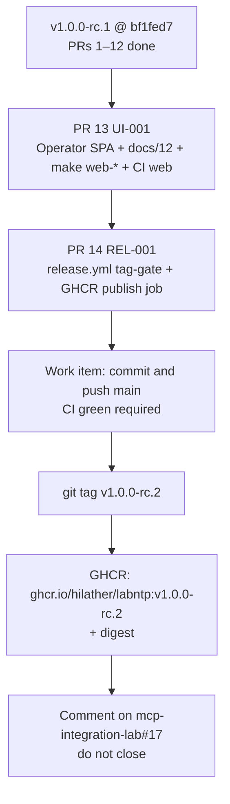
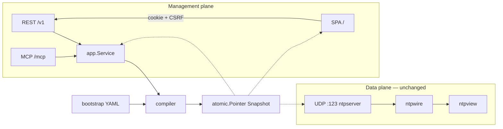
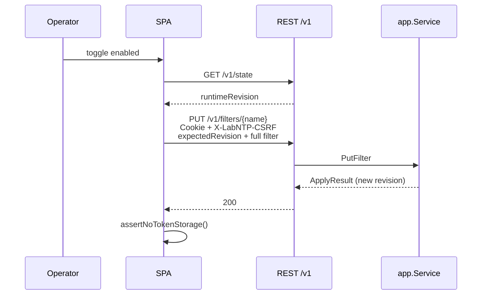

# LabNTP remaining work after v1.0.0-rc.1

| Field | Value |
|---|---|
| **Title** | LabNTP remaining work: operator SPA, GHCR publish, integrator comment |
| **Author** | Keystone / LabNTP |
| **Date** | 2026-08-30 |
| **Status** | Draft |
| **Target repo** | `/home/brewerm/git/go-lab-ntp` (`hilather/go-lab-ntp`) |
| **Baseline** | tag **v1.0.0-rc.1** at `bf1fed7` |
| **Source of truth (shipped)** | [docs/implementation-design.md](file:///home/brewerm/git/go-lab-ntp/docs/implementation-design.md) D1–D28, PRs 1–12 |
| **This document** | Remaining in-repo work after rc.1, then implementation sequence. D1–D28 stay frozen. New locks are **D29–D42**. |
| **Feature request** | [mcp-integration-lab#17](https://github.com/hilather/mcp-integration-lab/issues/17) (OPEN, unscheduled; Helm does not merge this) |

This document is the implementation plan for **what is left in `go-lab-ntp` after v1.0.0-rc.1**. It does not reopen the data plane, REST, MCP, auth, or overlay BOM. Integrator vendor pin in `mcp-integration-lab` stays out of this wave; the last work item comments on #17 with a digest pin the integrator can use later.

---

## Overview

v1.0.0-rc.1 shipped the LabNTP appliance minus the operator SPA and minus any GHCR image. `main` is clean at `bf1fed7`. `make web-*` still exits 1. There is no `.github/workflows/release.yml` and no image at `ghcr.io/hilather/labntp`. `mcp-integration-lab#17` is open and unscheduled.

This wave finishes the in-repo product:

1. **Operator SPA (UI-001 / original PR 13)** — Vite + React + TypeScript, Node 22.14.0, `go:embed` of `internal/web/dist`, cookie `labntp_session` + CSRF `X-LabNTP-CSRF`, no `localStorage` tokens, no new `features.list` ids.
2. **Tag-triggered GHCR publish** — sibling-faithful `release.yml` (tag-gate like LabDNS/LabMITM **plus** the publish job those repos still lack), image `ghcr.io/hilather/labntp`, scratch, UID 65532, HEALTHCHECK exec form.
3. **Commit and push `main`** after CI is green.
4. **Cut `v1.0.0-rc.2`, publish that tag’s image, comment on #17** without closing it.

SPA is user-visible. Publishing `v1.0.0-rc.1` into GHCR after this wave would ship a lie (image without SPA vs `main` with SPA). The published tag is **`v1.0.0-rc.2`**, the commit that includes this wave.

---

## Background & Motivation

### Current state (already shipped)

| Fact | Evidence |
|---|---|
| Tag | `v1.0.0-rc.1` @ `bf1fed7` — [releases/tag/v1.0.0-rc.1](https://github.com/hilather/go-lab-ntp/releases/tag/v1.0.0-rc.1) |
| Notes | [`docs/releases/v1.0.0-rc.1.md`](file:///home/brewerm/git/go-lab-ntp/docs/releases/v1.0.0-rc.1.md) |
| Branch | `main` == `origin/main`, working tree clean |
| Program board | [`tasks/00-program-board.md`](file:///home/brewerm/git/go-lab-ntp/tasks/00-program-board.md): PRs 1–12 **done**, PR 13 Operator SPA **pending** |
| Direct deps | `gopkg.in/yaml.v3` + `github.com/modelcontextprotocol/go-sdk v1.7.0` |
| CI | [`.github/workflows/ci.yml`](file:///home/brewerm/git/go-lab-ntp/.github/workflows/ci.yml) — no `web` job; comment says “web-* is PR 13” |
| Make | [`Makefile`](file:///home/brewerm/git/go-lab-ntp/Makefile) `web-install` / `web-test` / `web-build` / `web-embed` print “not implemented (PR 13)” and **exit 1** |
| Image | [`Dockerfile`](file:///home/brewerm/git/go-lab-ntp/Dockerfile) exists (`ghcr.io/hilather/labntp`, scratch, `USER 65532:65532`, HEALTHCHECK `CMD ["/labntp", "healthcheck", …]`). **No GHCR push. No `release.yml`.** |
| SPA packages | **`internal/web` does not exist.** `rest.Config` already has `UI` / `UIEnabled` and `tryUI` in [`internal/control/rest/server.go`](file:///home/brewerm/git/go-lab-ntp/internal/control/rest/server.go), but [`cmd/labntp/serve.go`](file:///home/brewerm/git/go-lab-ntp/cmd/labntp/serve.go) never sets them. |
| Session | Cookie `labntp_session`, CSRF `X-LabNTP-CSRF` already implemented in [`internal/auth/session.go`](file:///home/brewerm/git/go-lab-ntp/internal/auth/session.go) and REST handlers. |
| Features catalog | Frozen in [`internal/capabilities/features.go`](file:///home/brewerm/git/go-lab-ntp/internal/capabilities/features.go) and [`testdata/mcp/goldens/features.txt`](file:///home/brewerm/git/go-lab-ntp/testdata/mcp/goldens/features.txt). Comment: “PR 13 must not add ids.” |
| Overlay | [`examples/labntp.yaml`](file:///home/brewerm/git/go-lab-ntp/examples/labntp.yaml) already has `spec.ui.enabled: true`. Container smoke [`testdata/container/config.yaml`](file:///home/brewerm/git/go-lab-ntp/testdata/container/config.yaml) has `ui.enabled: false`. |
| Integrator | [mcp-integration-lab#17](https://github.com/hilather/mcp-integration-lab/issues/17) OPEN. Body: “Not scheduled. Helm does not merge this.” “Out of this wave until scheduled: do not block labgraph, fixture packs, mcp-integration-lab #12, or LabMITM UI.” |

### Pain points

1. Operators cannot enable/disable a tester filter or preview an IP without curling REST or MCP. The FR and D16 promised a SPA after the control plane.
2. `make web-*` fail-closed placeholders are correct until UI exists; they must become real targets in this wave.
3. There is no digest to pin. [`docs/11-deployment.md`](file:///home/brewerm/git/go-lab-ntp/docs/11-deployment.md) already names `ghcr.io/hilather/labntp` / `labntp:local`. The compose fragment `image: labntp:local` lives in [`docs/implementation-design.md`](file:///home/brewerm/git/go-lab-ntp/docs/implementation-design.md) (integrator contracts). [`docs/13-integration-lab.md`](file:///home/brewerm/git/go-lab-ntp/docs/13-integration-lab.md) has **no** `image:` line. GHCR must exist before the #17 comment can name a digest; PR 14 adds the tag/digest contract to `docs/13-integration-lab.md` without claiming that file already said `labntp:local`.
4. Sibling `release.yml` files (LabDNS, LabMITM) only **gate** tags. Neither publishes GHCR. LabNTP is the first family appliance that must actually push, because this wave’s last step is “publish the image.”

### Family patterns this wave copies (not product types)

| Concern | Sibling source |
|---|---|
| Vite + React 19 + TS, Node 22.14.0, npm 10.9.2 | [`go-lab-mitmproxy/web/package.json`](file:///home/brewerm/git/go-lab-mitmproxy/web/package.json) |
| In-memory CSRF, `credentials: "same-origin"`, `assertNoTokenStorage` | [`web/src/api/client.ts`](file:///home/brewerm/git/go-lab-mitmproxy/web/src/api/client.ts), [`web/src/api/storage.ts`](file:///home/brewerm/git/go-lab-mitmproxy/web/src/api/storage.ts) |
| `go:embed` stub vs dist, hashed-asset cache, reserved `/v1` `/mcp` | [`go-lab-mitmproxy/internal/web/fs.go`](file:///home/brewerm/git/go-lab-mitmproxy/internal/web/fs.go), [`handler.go`](file:///home/brewerm/git/go-lab-mitmproxy/internal/web/handler.go) |
| `cmd` wires `rest.Config.UI`; rest does not import `internal/web` | [`go-lab-mitmproxy/cmd/labmitm/serve.go`](file:///home/brewerm/git/go-lab-mitmproxy/cmd/labmitm/serve.go) lines 240–247 |
| `spec.ui.enabled: false` → 404 problem+json on `/` | [`go-lab-mitmproxy/internal/control/rest/spa_test.go`](file:///home/brewerm/git/go-lab-mitmproxy/internal/control/rest/spa_test.go) `TestSPADisabledIs404` |
| CI `web` job, Node 22.14.0, `make web-install web-test web-build` | [`go-lab-mitmproxy/.github/workflows/ci.yml`](file:///home/brewerm/git/go-lab-mitmproxy/.github/workflows/ci.yml) job `web` |
| Makefile `web-*` copies `web/dist` → `internal/web/dist` | [`go-lab-mitmproxy/Makefile`](file:///home/brewerm/git/go-lab-mitmproxy/Makefile) lines 85–99 |
| No Node stage in Dockerfile | LabMITM Dockerfile comment: “No Node stage — UI-001 embeds dist/ on the host.” LabNTP [`docs/11-deployment.md`](file:///home/brewerm/git/go-lab-ntp/docs/11-deployment.md) already says “No shell. No Node stage.” |
| Tag-gate on `v*` | [`go-lab-dns/.github/workflows/release.yml`](file:///home/brewerm/git/go-lab-dns/.github/workflows/release.yml), [`go-lab-mitmproxy/.github/workflows/release.yml`](file:///home/brewerm/git/go-lab-mitmproxy/.github/workflows/release.yml) |
| Gated Reset phrase | LabMITM `RESET_PHRASE = "RESET"` in [`web/src/ui/forbidden.ts`](file:///home/brewerm/git/go-lab-mitmproxy/web/src/ui/forbidden.ts) |

Do **not** copy LabMITM flow-inspector types, SSE live flows, CA download, or LabDNS Playwright/zone editor.

---

## Goals & Non-Goals

### Goals (this wave)

1. Ship the D16 operator SPA: filter table with enable/disable, preview-an-IP, leap/stratum chips, live vs reset-only labeled, query ring table, status (NTP bound / drifted / hostTime), gated Reset.
2. Wire `spec.ui.enabled` to the already-present REST `tryUI` path. Management still defaults `--management-listen=off`. Image CMD still binds `:8088`.
3. Replace fail-closed `make web-*` with LabMITM-identical targets. Add CI job `web`. Keep `make test-container` green.
4. Add `docs/12-web-ui.md` and list it in `scripts/checkdocs` `RequiredRootDocs`.
5. Add `.github/workflows/release.yml`: tag-gate (sibling) + GHCR publish (new, because siblings do not push).
6. After CI green: commit and push `hilather/go-lab-ntp` `main`.
7. Cut **`v1.0.0-rc.2`**, publish `ghcr.io/hilather/labntp:v1.0.0-rc.2`, comment on #17 with tag + digest + integrator split. Do **not** close #17.

### Non-goals (this wave)

- Full `mcp-integration-lab` vendor pin / compose service / overlay / labinfo merge / Helm. **Comment only.**
- Teaching scratch appliances to NTP-query.
- NTS, broadcast/multicast, PTP.
- Setting the LabNTP process or lab host clock (D14).
- Wrapping chrony/ntpd.
- New `features.list` ids (frozen in PR 9 goldens).
- New Go module dependencies. No NTP library. No Prometheus client.
- Playwright / e2e browser suite (LabDNS has it; LabMITM inspector does not — copy LabMITM).
- Publishing `v1.0.0-rc.1` to GHCR.
- Pushing `:latest` for a prerelease tag.
- Multi-arch (`linux/arm64`) in the first publish. CI and `test-container` are `linux/amd64`.
- Defaulting omitted `spec.ui.enabled` to `true` (rc.1 zero-value is `false`; overlay already sets `true`).
- Expanding D24 (`userland-proxy` / NAT collision) unless SPA or GHCR docs would otherwise go stale — they will not.
- Mira sign-off as a merge or tag gate (Mira reviews **after** first UI lands; findings become a later rc if needed).
- Creating missing original-pack `docs/10-testing-strategy.md` / `docs/known-limitations.md` unless a link from this wave’s docs requires them.

---

## Key Decisions

| ID | Decision | Rationale |
|---|---|---|
| **D29** | Publish **`v1.0.0-rc.2`**, not `v1.0.0-rc.1`. SPA lands on `main` first; the tag that GHCR ships **is the tag that includes this wave**. | SPA is user-visible. Publishing rc.1 after SPA exists on `main` would ship a GHCR lie. The user asked the last step to “publish the image”; that image must match the commits being announced on #17. |
| **D30** | SPA stack is **LabMITM-identical**: Node **22.14.0**, npm **≥10.9.0**, Vite 8, React 19, React Router 7, TypeScript ~5.9, Vitest 4, jsdom, Testing Library. Package name `labntp-web`. | D18 already pinned Node 22.14.0. Copy patterns, not LabMITM product types. Do not add Playwright. |
| **D31** | Embed via `go:embed` of **`internal/web/dist`**. Dockerfile stays **no Node stage**. `make web-build` copies `web/dist` → `internal/web/dist`. Commit the embedded dist so `go test` / `docker build` / GHCR do not need Node. `web/dist/` and `web/node_modules/` stay gitignored (already in [`.gitignore`](file:///home/brewerm/git/go-lab-ntp/.gitignore)). | Identical to LabMITM. Scratch image cannot run Node. |
| **D32** | First UI screens are **exactly D16**: Filters (home), Preview, Features, Queries, Status, gated Reset, Login. **No** audit page, **no** YAML editor. The table-only “enable/disable + chips” first cut is **superseded** by the Matt-approved chrome in [docs/12-web-ui.md](12-web-ui.md) (list-order inventory + inspector Save of Filter fields `PUT` already accepts). | FR screens unchanged. Inspector is chrome over existing `PutFilter`, not a YAML editor. |
| **D33** | Enable/disable is `PUT /v1/filters/{name}` through existing `app.Service.PutFilter` with `expectedRevision` from `GET /v1/state` `runtimeRevision`. CSRF header `X-LabNTP-CSRF`. Requires `ntp.write`. | Filters CRUD already exists ([`handlers.go`](file:///home/brewerm/git/go-lab-ntp/internal/control/rest/handlers.go) `handleFiltersPut`). SPA is an adapter, not a second mutation path. |
| **D34** | Query ring is **polled** (`GET /v1/queries`, default 5s, limit 256). No EventSource, no pcap download, no virtualized JS heap browser, no log dump beyond the ring. | FR: “No JS heap browser for logs beyond the query ring.” LabMITM SSE is for flows; LabNTP has no query SSE. |
| **D35** | **Must not** add `features.list` ids. SPA renders `GET /v1/features` as live vs reset-only chips. Golden [`testdata/mcp/goldens/features.txt`](file:///home/brewerm/git/go-lab-ntp/testdata/mcp/goldens/features.txt) stays bit-identical. | D12 / PR 9 freeze. [`features.go`](file:///home/brewerm/git/go-lab-ntp/internal/capabilities/features.go) already says “PR 13 must not add ids.” |
| **D36** | Cookie `labntp_session` HttpOnly SameSite=Lax Path=/; CSRF `X-LabNTP-CSRF` in **process memory only** (`web/src/api/client.ts` `memoryCSRF`). Vitest forbids `localStorage` / `sessionStorage` token keys via `web/src/api/storage.ts`. Never HTTP Basic. | D10 already implemented server-side. SPA must not regress it. |
| **D37** | `spec.ui.enabled: false` → `GET /` is **404 `application/problem+json`**, REST/MCP unchanged. Omitted `ui.enabled` stays **false** (rc.1 zero-value). Overlay BOM keeps `true`. Container smoke keeps `false`. | `tryUI` already returns false when `UIEnabled()` is false. Do not sneak in the unimplemented “default true if management would bind” from the original normalize prose. |
| **D38** | `internal/control/rest` **production** files must not import `internal/web`. `cmd/labntp/serve.go` sets `rest.Config.UI = web.NewHandler(nil)` and `UIEnabled` from the live snapshot. Tests in `rest` may import `web` (LabMITM `spa_test.go`). Write the fence in **`AGENTS.md`** and a one-line pointer in `docs/01-architecture.md`; `import_test.go` is the lock. | Today AGENTS.md only fences `ntpserver`/`ntpwire`/`ntpview`/`ntpkeys` away from `control`/`web`. Agents will miss D38 unless the human/agent rule file says it. |
| **D39** | GHCR workflow is **tag-triggered** `v*`. Job graph: **tag-gate** (sibling: dirty-tree reject, `verify-generated`, notes file exists, required CI green on the exact SHA) **then** **publish-image**. **`publish-image` runs only on `push` of tags `v*`.** `workflow_dispatch` is **re-gate only** (LabDNS/LabMITM shape): it must **not** push GHCR. No push-to-main publish. | User asked sibling-faithful **tag-triggered** publish. Dispatch with `type=ref,event=tag` would tag nothing and could still push a `sha-*` image of `main`. |
| **D40** | Image tags: `ghcr.io/hilather/labntp:<git-tag>` (e.g. `v1.0.0-rc.2`) and `ghcr.io/hilather/labntp:sha-<7 hex>` (`docker/metadata-action` `type=sha,prefix=sha-,format=short` — Git default **7** characters, not 12). **No `:latest` on prerelease** (`v*-rc*`, `v*-alpha*`, `v*-beta*`). Platform **`linux/amd64` only**. Provenance + SBOM **on** (`provenance: mode=max`, `sbom: true`). **Digest is the integrator pin**, not the `sha-*` tag. | Integrator must digest-pin. `:latest` on an rc would be another lie. Multi-arch is later. Do not invent `format=short` as 12 hex. |
| **D41** | Mira reviews **after the SPA exists on the branch that will be tagged** (after PR 13 merge, or after the UI-001 slice is complete on a local tree). Mira is **not** a merge gate, **not** a tag gate, **not** a GHCR gate. Findings → later tag if user-visible. | Original D16 / #17: “Mira reviews the operator UI after first implementation.” This wave’s last step is publish + comment. Sequential local commits mean Mira may see SPA+release.yml together; that is fine. |
| **D42** | #17 comment **does not close the issue**. It names the tag + digest, splits appliance-vs-integrator ownership, and states Helm/integrator pin is **not** this wave and **must not** block labgraph, fixture packs, mcp-integration-lab #12, or LabMITM UI. | Issue text: “Not scheduled. Helm does not merge this.” Closing would imply the integrator pin landed. |

---

## Proposed Design

### Wave shape



PRs 13 and 14 are independently reviewable slices. They may land as GitHub PRs or as sequential commits on this working tree; the **last two work items** are still commit/push then publish+comment.

### Process after this wave



UDP still never imports `internal/control` or `internal/web`. `--management-listen=off` still leaves SPA unreachable (nothing bound). Image CMD still binds `:8088` so HEALTHCHECK and the SPA work in compose.

---

### 1. Operator SPA (UI-001)

#### Package layout (new)

```text
web/                            # Vite app; dist gitignored
  package.json                  # labntp-web; engines.node >=22.14.0 <23
  package-lock.json             # committed
  tsconfig.json
  vite.config.ts                # proxy /v1 and /mcp to 127.0.0.1:8088
  vitest.config.ts
  index.html
  scripts/check-bundle.mjs      # 450 KiB JS entry budget (LabMITM)
  src/
    api/client.ts               # CSRF_HEADER = "X-LabNTP-CSRF"
    api/storage.ts              # assertNoTokenStorage
    api/types.ts                # LabNTP DTOs only
    api/*.test.ts
    auth/AuthProvider.tsx
    auth/scopes.ts              # ntp.read / ntp.write / ntp.admin / ntp.audit.read
    pages/LoginPage.tsx
    pages/FiltersPage.tsx       # home
    pages/PreviewPage.tsx
    pages/FeaturesPage.tsx
    pages/QueriesPage.tsx
    pages/StatusPage.tsx
    pages/ResetPage.tsx
    ui/reset.ts                 # RESET_PHRASE = "RESET" (not LabMITM forbidden.ts)
    styles.css
    test/setup.ts
    test/render.tsx             # LabMITM-shaped MemoryRouter + AuthProvider helper
    App.tsx                     # skip-link, Shell, RequireSession
    main.tsx
internal/web/
  stub/index.html               # title/h1 "LabNTP"; "run make web-build" body
  dist/                         # committed embed of production Vite output
  fs.go                         # Files() prefers dist/index.html else stub
  handler.go                    # NewHandler, Reserved
  handler_test.go
  imports_test.go
  doc.go
```

#### Go embed (copy LabMITM `fs.go` / `handler.go`)

`internal/web/fs.go`:

```go
//go:embed all:stub
var stub embed.FS

//go:embed all:dist
var dist embed.FS

// Files returns production Vite when dist/index.html exists, else stub.
func Files() fs.FS { /* identical shape to LabMITM */ }
```

`NewHandler` serves GET/HEAD only. Hashed assets (`assets/name-<≥8 hex>.js`) get `Cache-Control: public, max-age=31536000, immutable`. `index.html` gets `no-cache`. SPA fallback: unknown paths without a non-html extension serve `index.html`. Reserved paths **must not** be captured:

- `/v1`, `/v1/*`
- `/mcp`, `/mcp/*`
- `/healthz`, `/config`, `/.well-known` (family reserved set)

Missing hashed assets 404 (not index.html).

`go:embed` cannot embed an empty directory. Commit `internal/web/dist/.keep` is **not** enough once Vite runs; the SPA PR commits the real `index.html` + hashed assets after `make web-build`. Stub remains for the “forgot web-build” local binary.

#### Wire-up in `cmd/labntp/serve.go`

Today `rest.New` is called without `UI` / `UIEnabled` ([`serve.go`](file:///home/brewerm/git/go-lab-ntp/cmd/labntp/serve.go) ~159–177). After this wave:

```go
import "github.com/hilather/go-lab-ntp/internal/web"

restSrv, err = rest.New(rest.Config{
    // existing fields unchanged
    UI: web.NewHandler(nil),
    UIEnabled: func() bool {
        snap := store.Load()
        if snap == nil || snap.Canonical == nil {
            return false
        }
        return snap.Canonical.Spec.UI.Enabled
    },
})
```

`tryUI` already exists:

```360:372:internal/control/rest/server.go
func (s *Server) tryUI(w http.ResponseWriter, r *http.Request) bool {
	if s.cfg.UI == nil {
		return false
	}
	if s.cfg.UIEnabled != nil && !s.cfg.UIEnabled() {
		return false
	}
	if strings.HasPrefix(r.URL.Path, "/v1") || strings.HasPrefix(r.URL.Path, "/mcp") {
		return false
	}
	s.cfg.UI.ServeHTTP(w, r)
	return true
}
```

Tighten `tryUI` to LabMITM’s shape in the same PR:

- Rate-limit SPA GETs (`s.rate.allow`) so `/` is not an unbound static flood path.
- Use `path.Clean` reserved-prefix checks (`/v1`, `/mcp`, `/healthz`, `/config`, `/.well-known`) so `/v1foo` is not treated as API and `/mcp` misses stay problem+json.
- Production `rest` files still must not import `internal/web`.

`spec.ui.enabled` has **no live Apply op**. `rejectResetOnly` in [`internal/app/operations.go`](file:///home/brewerm/git/go-lab-ntp/internal/app/operations.go) lists listeners / NTS / keys / auth only — it does **not** mention `spec.ui`. `ChangeIn` has no full-document replace, so operators cannot Apply a UI bit even if they wanted to. Supported path: rewrite bootstrap YAML, then **Reset or process restart**. `UIEnabled` reads `store.Load().Canonical.Spec.UI.Enabled` after that reread. Do **not** add feature id `ui` (D35). Do **not** document `ui.enabled` as a catalog `reset-only` row — it is simply not in `features.list`. Features page footnote: “UI enablement is bootstrap YAML; reread with Reset. Not a features.list id.” Document the same in `docs/12-web-ui.md`.

#### REST wire shapes the SPA must type (`web/src/api/types.ts`)

No new REST routes. `writeJSON` runs [`config.FormatWireTree`](file:///home/brewerm/git/go-lab-ntp/internal/config/export.go); inbound JSON runs [`CoerceWireTree`](file:///home/brewerm/git/go-lab-ntp/internal/config/duration.go), which **rejects bare numbers** for duration fields (`duration must be a string such as 5s, not a bare number`). Round-tripping a GET filter object works. A TypeScript `number` for `offset` will 400.

`types.ts` rules:

- Duration fields are **`string`**, never `number`: `offset`, `rootDelay`, `rootDispersion`, `jitter` (Go `FormatDuration`, e.g. `"0s"`, `"-6m"`).
- Wire names stay FR spellings: `minpoll`, `maxpoll`, `refid` (not `minPoll` / `refID`).
- `rate` is `number | undefined` — omit the key when GET omitted it; do not send `0` unless GET had `0`.
- `expectedRevision` for PUT comes from **`GET /v1/state`** `runtimeRevision` (camelCase). Do **not** read `status.revisions.runtimeRevision`.

| Screen | API | Scope |
|---|---|---|
| Login | `POST /v1/session` with `Authorization: Bearer` | token |
| Session restore | `GET /v1/session` (cookie) | cookie |
| Logout | `DELETE /v1/session` + CSRF | cookie |
| Filters | `GET /v1/filters` | `ntp.read` |
| Enable/disable | `PUT /v1/filters/{name}` | `ntp.write` |
| Preview | `GET /v1/views/preview?ip=` | `ntp.read` |
| Features | `GET /v1/features` | `ntp.read` |
| Queries | `GET /v1/queries?limit=` | `ntp.read` |
| Status | `GET /v1/status` (`ready`, `hostTime`, `listeners`) **plus** `GET /v1/state` (camelCase revision/drifted) | `ntp.read` |
| Reset | `POST /v1/state:reset` `{reason}` | `ntp.admin` |

**Session** (already camelCase):

```json
// POST /v1/session → 200
{ "csrf": "<hex>", "expiresAt": "RFC3339Nano" }

// GET /v1/session → 200
{ "id": "admin", "role": "administrator", "scopes": ["ntp.read", "ntp.write", "ntp.admin", "ntp.audit.read"], "csrf": "<hex>", "expiresAt": "RFC3339Nano" }
```

**Filter GET** (`GET /v1/filters` → `{ "items": [ Filter, … ] }`; `GET /v1/filters/{name}` → one Filter). `handleFiltersList` writes `[]model.Filter` through `FormatWireTree`:

```json
{
  "name": "default",
  "enabled": true,
  "match": { "cidrs": ["0.0.0.0/0", "::/0"] },
  "view": {
    "mode": "follow-real",
    "offset": "0s",
    "leap": "none",
    "stratum": 2,
    "refid": "GPS",
    "precision": -20,
    "rootDelay": "0s",
    "rootDispersion": "0s",
    "jitter": "0s"
  }
}
```

Optional view keys when present: `absolute` / `freezeAt` / `epoch` (RFC3339 strings), `rate` (JSON number), `minpoll` / `maxpoll` (JSON numbers). Follow-real GET typically has **no** `rate` key.

**Filter PUT envelope** (`PUT /v1/filters/{name}`):

```json
{
  "expectedRevision": "sha256:<hex>",
  "reason": "ui: disable filter",
  "filter": { /* the GET object with only enabled flipped */ }
}
```

`idempotencyKey` optional. Path `{name}` must equal `filter.name`. Client copies the GET item, sets `enabled`, and PUTs **the same duration strings** (`"0s"`). Do not coerce to numbers.

**Preview** (already camelCase; `servedTime` null on miss):

```json
{
  "ip": "10.99.42.20",
  "filter": "tester-a-kerberos",
  "servedTime": "2026-08-30T12:00:00Z",
  "hostTime": "2026-08-30T12:06:00Z",
  "mode": "offset",
  "leap": "none",
  "stratum": 1,
  "refid": "LOCL",
  "offsetFromHost": "-6m0s"
}
```

Allowlist / unmatched is **200** with `reason: "allowlist"|"unmatched"` and `"servedTime": null` — not 404.

**Queries** (`GET /v1/queries?limit=256` → `{ "items": […], "nextCursor": "" }`):

```json
{
  "clientIP": "10.99.42.20",
  "filter": "default",
  "servedTime": "RFC3339Nano",
  "leap": "none",
  "mode": "follow-real",
  "vn": 4,
  "whenHost": "RFC3339Nano"
}
```

**Features:** `{ "items": [ { "id": "filters", "apply": "live", "path": "spec.filters" }, … ] }` — frozen 12 ids.

**State vs Status (do not mix):**

`GET /v1/state` uses `stateViewJSON` (camelCase) — **this is the revision source**:

```json
{
  "bootstrapRevision": "sha256:…",
  "runtimeRevision": "sha256:…",
  "generation": 1,
  "drifted": false,
  "loadedAt": "RFC3339Nano",
  "canonical": { }
}
```

`GET /v1/status` uses `statusResponse` for the outer object but **`marshalAPI(st.Revisions)` on `app.RevisionView` and `[]app.Warning` which have no `json` tags**, so nested keys are **Go PascalCase**:

```json
{
  "ready": true,
  "hostTime": "RFC3339Nano",
  "listeners": [ { "name": "ntp", "address": ":123" } ],
  "revisions": {
    "BootstrapRevision": "sha256:…",
    "RuntimeRevision": "sha256:…",
    "Generation": 1,
    "Drifted": false,
    "LoadedAt": "…"
  },
  "warnings": [ { "Code": "overlap", "Message": "…" } ]
}
```

Status page: `ready` / `hostTime` / `listeners` from `/v1/status`; `runtimeRevision` / `bootstrapRevision` / `generation` / `drifted` from `/v1/state`. If warnings are shown, read `Code` / `Message` (PascalCase). This wave **does not** change the Status JSON contract.

**Lock:** Vitest or a Go REST contract test: `GET /v1/filters` a follow-real item, flip only `enabled`, `PUT` the GET body including `"offset":"0s"` → 200. A PUT with `"offset": 0` (number) → 400. A golden or typed fixture asserts `GET /v1/status` has `revisions.BootstrapRevision` (not `runtimeRevision`) so the SPA cannot “fix” this by guessing camelCase.

Query ring default size 256, max 4096; list handler default limit 64, max 256 ([`app/preview.go`](file:///home/brewerm/git/go-lab-ntp/internal/app/preview.go)). SPA requests `limit=256` so the table is the ring, not a truncated page. `nextCursor` is ignored on the first page of ≤256; do not walk a JS heap of history.

Filter enable/disable sequence:



PUT body must send the **full** GET filter object (name, enabled, match, view, duration **strings**). The client copies the GET item, flips `enabled`, and PUTs. Name in path must equal `filter.name` (already enforced). Stale revision → problem+json; SPA shows detail and refreshes.

#### Routes (`App.tsx`)

Copy LabMITM `BrowserRouter` + `AuthProvider` + `RequireSession` / `RedirectIfSignedIn`. Include a skip-link (`<a class="skip-link" href="#app-main">Skip to main content</a>`) and a `Shell` header like LabMITM `App.tsx`. Copy `web/src/test/render.tsx` (MemoryRouter + AuthProvider, `json()`, `sessionView()`, `seedCSRF()`, `resetClientState()`) with scopes `ntp.*` not `mitm.*`.

**Stub** [`internal/web/stub/index.html`](file:///home/brewerm/git/go-lab-mitmproxy/internal/web/stub/index.html) is LabMITM’s “run make web-build” page with product name swapped:

```html
<!doctype html>
<html lang="en">
  <head>
    <meta charset="UTF-8" />
    <meta name="viewport" content="width=device-width, initial-scale=1.0" />
    <title>LabNTP</title>
  </head>
  <body>
    <main>
      <h1>LabNTP</h1>
      <p>UI assets were not copied. Run <code>make web-build</code> before embedding a production binary.</p>
    </main>
  </body>
</html>
```

`spa_test.go` asserts substring `LabNTP` (not `LabMITM`) on `GET /` when UI is enabled and the test handler uses the stub or a fixture containing that title. Production `internal/web/dist/index.html` after `web-build` also contains `LabNTP`.

Vite `server.proxy`: `/v1` and `/mcp` → `http://127.0.0.1:8088`. Do **not** require `/healthz` (LabNTP health is `/v1/health/*`; LabMITM’s `/healthz` proxy is unused here).

| Path | Page | Nav |
|---|---|---|
| `/login` | LoginPage | anonymous only |
| `/` | FiltersPage | signed-in |
| `/preview` | PreviewPage | signed-in |
| `/queries` | QueriesPage | signed-in |
| `/features` | FeaturesPage | signed-in |
| `/status` | StatusPage | signed-in |
| `/reset` | ResetPage | `ntp.admin` only in nav; page still gates submit |
| `*` | Navigate `/` | |

Nav labels: Filters, Preview, Queries, Features, Status, Reset (if `ntp.admin`). No “Fuzzer / Repeater / …” LabMITM forbidden-control list is irrelevant; do not copy those labels.

Login copy: “Exchange a scoped API bearer token for an HttpOnly session cookie. Credentials are not written to web storage. LabNTP does not accept HTTP Basic.” Token input `type="password"` `autoComplete="off"`.

Reset copy: Reset rereads bootstrap YAML, wipes the query ring, never writes the file, rebinds per D8. Phrase **`RESET`**, checkbox confirm, optional reason. Submit disabled unless `ntp.admin` && phrase == `RESET` && confirmed.

#### Filters workspace (home)

List-order inventory (~340px) plus clock inspector. Inventory rows: ordinal, name, CIDRs, mode chip, ENABLED/disabled. Caption: first **enabled** CIDR hit wins. Longest-prefix does not. Catch-all stays last. No drag-reorder (that is `replaceFilters` / YAML).

Inspector: SERVE THIS VIEW checkbox and Enable/Disable (PUT of last GET with `enabled` flipped; reasons `ui: enable filter` / `ui: disable filter`). Save view PUTs mode-conditional fields the API already accepts (`offset` / `absolute` / `freezeAt` / `rate`, leap, stratum, refid). Reason `ui: save view`. Do not invent precision / rootDelay / jitter / minpoll. In-pane math is selected-filter only (sample IP = first CIDR host, read-only). Compiled match walk is the Preview route.

#### Preview page

Form: IP text field, submit “Preview”. Calls `GET /v1/views/preview?ip=`. Shows served vs host, filter name, mode, leap, stratum, offsetFromHost, or `reason`. Helper text: preview does not send NTP; host-publish NAT collision does not affect preview (D24).

#### Features page

Table of frozen ids. Column **Apply** is exactly `live` or `reset-only` as chips. Footnote: “UI enablement is bootstrap YAML; reread with Reset. Not a features.list id.” Do not imply a catalog guarantee for `spec.ui`.

#### Queries page

Table of the ring, newest first: whenHost, clientIP, filter, servedTime, leap, mode, vn. Poll 5s while mounted. “Dropped samples” is **not** on the REST DTO today — do not invent a metric on the page. No download button.

#### Status page

From `GET /v1/status` + `GET /v1/state`:

- Ready (yes/no)
- Drifted (runtime ≠ bootstrap)
- HostTime (RFC3339)
- Listeners (name + address) — “NTP bound” is the `ntp` listener row plus ready
- Warnings
- Revisions (bootstrap / runtime / generation)

Banner: “LabNTP is not a production time source. The host clock never moves.”

#### Client security (`web/src/api/`)

Port LabMITM `client.ts` / `storage.ts` with these substitutions only:

- `CSRF_HEADER = "X-LabNTP-CSRF"`
- `TOKEN_KEY` regex uses `labntp` not `labmitm`
- problem URN fallback `urn:labntp:error:…`
- `createSession` stores CSRF in the module-level variable, **not** in `localStorage`
- every `apiFetch` calls `assertNoTokenStorage()`
- mutating methods attach CSRF when the in-memory secret is set
- GET/HEAD never send CSRF
- `credentials: "same-origin"` always
- login uses `Authorization` once; after cookie is set, no bearer in JS except the login POST

Tests (Vitest, fail before/pass after):

1. `storage.test.ts` — reject `localStorage` key `token` / value `Bearer …`; allow empty storage.
2. `client.test.ts` — session create does not write web storage; CSRF copied onto DELETE; CSRF omitted on GET.
3. `FiltersPage.test.tsx` — enable toggle issues PUT with `expectedRevision` from `/v1/state` `runtimeRevision`, CSRF header, and duration strings (`"offset":"0s"`); viewer (`ntp.read` only) has disabled checkbox. PUT of a GET follow-real item with only `enabled` flipped succeeds in the Go contract test (including `"offset":"0s"`); numeric `"offset": 0` fails.
4. `ResetPage.test.tsx` — submit disabled until phrase `RESET` + confirm + admin.
5. `PreviewPage.test.tsx` — `reason: unmatched` renders without throwing.
6. `FeaturesPage.test.tsx` — renders `live` / `reset-only` from fixture matching frozen ids; **does not** introduce a thirteenth id.
7. `nav.test.ts` — Reset link absent without `ntp.admin`.
8. `test/render.tsx` used by page tests (not ad-hoc wrappers).

#### Make targets

Replace the exit-1 placeholders:

```make
web-install:
	npm --prefix web ci

web-test:
	npm --prefix web test

web-build:
	npm --prefix web run build
	$(MAKE) web-embed

web-embed:
	@mkdir -p internal/web/dist
	@rm -rf internal/web/dist/assets
	@if [ -d web/dist ]; then cp -a web/dist/. internal/web/dist/; fi
	@echo "copied web/dist -> internal/web/dist"
```

`web/package.json` `build` script: `tsc --noEmit && vite build && node ./scripts/check-bundle.mjs` (450 KiB, LabMITM).

#### CI job `web`

Add to [`.github/workflows/ci.yml`](file:///home/brewerm/git/go-lab-ntp/.github/workflows/ci.yml), sibling of LabMITM:

```yaml
  web:
    name: web
    runs-on: ubuntu-latest
    timeout-minutes: 15
    steps:
      - uses: actions/checkout@3d3c42e5aac5ba805825da76410c181273ba90b1 # v7.0.1
      - uses: actions/setup-node@49933ea5288caeca8642d1e84afbd3f7d6820020 # v4.4.0
        with:
          node-version: "22.14.0"
          cache: npm
          cache-dependency-path: web/package-lock.json
      - name: Committed embed is a real Vite tree
        run: |
          set -euo pipefail
          # Inspect the checkout *before* web-build. container-test and
          # publish-image docker-build that tree (no Node stage). Asserting
          # after web-build would only prove CI can produce a dist, not that
          # git contains one.
          test -f internal/web/dist/index.html
          grep -E -q '<title>LabNTP</title>|<div id="root">' internal/web/dist/index.html
          ! grep -q 'UI assets were not copied' internal/web/dist/index.html
          ls internal/web/dist/assets/*.js >/dev/null
      - name: Operator SPA source still builds
        run: |
          make web-install
          make web-test
          make web-build
```

Pin action SHAs (already the family pin for checkout; setup-node SHA matches LabMITM). Required jobs comment at top of `ci.yml` must list `web`. Do not mark it optional.

**Do not** `git diff --exit-code -- internal/web/dist`. LabMITM’s `web` job is install/test/build only. Vite 8 is not guaranteed bit-identical across runners (asset hash, HTML injection); a required full-tree diff can fail a correct embed and block tag-gate.

The GHCR/Docker embed is the **committed** `internal/web/dist` (`go:embed`, no Node stage). The Vite-tree step must run on the checkout **before** `make web-build`. `web-build` is a separate “`web/src` still compiles” step and may rewrite the runner’s working copy; that rewrite is not what `container-test` / `publish-image` ship.

Also add `internal/web/fs_test.go` `TestCommittedDistIsProduction`: `Files()` must not serve the stub sentence `"UI assets were not copied"`. That fails the **unit** job if git has only the stub, so tag-gate cannot publish a stub even if someone reorders the `web` YAML. `spa_test.go` may still use an in-memory fixture or stub for fallback behavior; it must not be the only HTML lock.

Document this order in `docs/12-web-ui.md`. Do not require `SOURCE_DATE_EPOCH` unless a later wave proves bit-identity; it is not the rc.2 lock.

#### Go tests (new / extended)

| Test | Lock |
|---|---|
| `internal/web/handler_test.go` | SPA fallback, hashed cache, reserved paths not HTML, missing asset 404 |
| `internal/web/fs_test.go` | `TestCommittedDistIsProduction`: `Files()` is not the stub page |
| `internal/web/imports_test.go` | production web must not import `internal/app`, `internal/control`, `internal/ntpserver` |
| `internal/control/rest/spa_test.go` | enabled `/` HTML 200 containing `LabNTP`; disabled `/` problem 404; `/v1/does-not-exist` stays problem+json not HTML |
| `internal/control/rest/import_test.go` | extend: non-`_test.go` files must not import `internal/web` |
| REST contract (filters PUT) | GET follow-real + flip `enabled` + PUT with `"offset":"0s"` 200; `"offset":0` 400 |
| `cmd/labntp` serve test (small) | with `ui.enabled: true` and management bound, `GET /` is HTML; with `false`, 404 |
| `scripts/checkdocs` | `docs/12-web-ui.md` in `RequiredRootDocs` |
| existing `example_overlay_test.go` | `ui.enabled` stays true — keep |

Container smoke (`testdata/container/config.yaml` `ui.enabled: false`): add an assertion that `GET /` after ready is **404**, REST `/v1/health/ready` still 200. That proves SPA disablement in the image without making `test-container` depend on cookies. Do not flip smoke UI on.

#### Docs (same PR)

| Path | Change |
|---|---|
| `docs/12-web-ui.md` | **New.** Screens, cookie/CSRF, polling, no localStorage, `spec.ui.enabled`, Mira-after-land, **same-origin + `allowedOrigins`**, **committed-dist lock: CI asserts checkout *before* `web-build` (no full-tree git-diff)**. Metadata: Status / Owners / Last reviewed. |
| `scripts/checkdocs/main.go` | Append `docs/12-web-ui.md` to `RequiredRootDocs`. Add `.github/workflows/release.yml` in PR 14, not here. |
| `docs/README.md` | Catalog row for 12. |
| `docs/01-architecture.md` | UI `/` is no longer “later PR”. Package table includes `internal/web`. **Import table:** production `internal/control/rest` must not import `internal/web` (cmd wires `Config.UI`). |
| `AGENTS.md` | Same rest→web production fence (D38). |
| `docs/06-rest-api.md` | SPA is served from management HTTP when UI enabled. Duration strings; Status PascalCase nested revisions. |
| `docs/08-security-architecture.md` | Point at SPA client tests. Origin: missing and loopback allowed; non-loopback needs exact `allowedOrigins` entry; overlay stays `[]`. |
| `docs/05-control-plane-and-parity.md` | Reiterate frozen features ids. |
| `docs/11-deployment.md` | SPA is embedded; still no Node stage. |
| `README.md`, `START-HERE.md` | SPA exists; how to `make web-install` for local Vite. `--management-listen` still defaults off. |
| `CHANGELOG.md` | Unreleased: operator SPA. |
| `tasks/00-program-board.md` | UI-001 in progress/done. |
| `docs/implementation-design.md` | Pointer: SPA implemented per this remaining-work design; D16 satisfied. Do not rewrite D1–D28. |
| `CONTRIBUTING.md` | Node 22.14.0 for `web/`. |

`docs/12-web-ui.md` must not drop required phrases from `docs/` (they already live in `docs/02-ntp-semantics.md`). If 12 mentions host publish, keep `userland-proxy` / `NAT collision` wording consistent; do not expand D24.

#### Mira

Notify Mira (human) when UI-001 is complete on the **branch that will be tagged** — after PR 13 merge, or after the SPA slice is done on a local tree if slices land as sequential commits. Do not wait for PR 14. Findings are not a blocker for PR 14 or tagging unless they are security defects (localStorage tokens, CSRF missing, Basic auth). Security defects **are** a tag blocker (AGENTS.md: no tag on red CI; a security fail is red).

---

### 2. GHCR image publish (REL-001)

#### Sibling gap

LabDNS and LabMITM [`release.yml`](file:///home/brewerm/git/go-lab-dns/.github/workflows/release.yml) implement **tag-gate only**: checkout the tag, reject dirty tree, `make verify-generated`, require `docs/releases/${tag}.md`, require green CI on that SHA. They explicitly do **not** `docker push`. LabNTP must keep that gate **and** add `publish-image`, because this wave’s last step cannot succeed without a digest.

#### New workflow `.github/workflows/release.yml`

```yaml
name: Release

on:
  push:
    tags:
      - "v*"
  workflow_dispatch:
    inputs:
      ref:
        description: Git tag (vX.Y.Z or vX.Y.Z-rc.N) to **re-gate** (no GHCR push)
        required: true
        type: string

permissions:
  contents: read
  actions: read
  checks: read

concurrency:
  group: release-${{ github.workflow }}-${{ github.event.inputs.ref || github.ref }}
  cancel-in-progress: false

env:
  GO_VERSION: "1.26.6"
  GOTOOLCHAIN: local
  GOPROXY: https://proxy.golang.org,direct
  IMAGE: ghcr.io/hilather/labntp
```

**Job `tag-gate`** (runs on tag `push` **and** `workflow_dispatch`; permissions inherit read-only). Scaffolding copies LabDNS/LabMITM: checkout, **`actions/setup-go`** (required for `go run ./scripts/release-gate` and `make verify-generated`), dirty-tree, verify-generated, notes path.

Pin (same SHAs as `ci.yml`):

- `actions/checkout@3d3c42e5aac5ba805825da76410c181273ba90b1` # v7.0.1
- `actions/setup-go@b7ad1dad31e06c5925ef5d2fc7ad053ef454303e` # v7.0.0

Steps:

1. Checkout `${{ github.event.inputs.ref || github.ref }}` with `fetch-depth: 0`.
2. `git rev-parse HEAD` → `sha`.
3. `git diff --exit-code && git diff --cached --exit-code`.
4. `make verify-generated`.
5. Resolve notes `docs/releases/${tag}.md` where `tag` is `inputs.ref` stripped of `refs/tags/` or `github.ref_name`. Missing file **exit 1**.
6. `go run ./scripts/release-gate -notes-only -notes docs/releases/${tag}.md`. LabNTP-sized headings (**not** LabMITM’s 17-heading soup): `Highlights`, `Added`, `Residual`, `Deployment and operations`, `CI and release evidence`. Reject `TODO` / `TBD` / `FIXME`.
7. `go run ./scripts/release-gate -require-ci` with `GH_TOKEN: ${{ github.token }}` and `GITHUB_SHA` = that SHA. Implementation: `gh run list --workflow=ci.yml --commit=$sha --json databaseId,conclusion,status,headSha,event` (workflow file `ci.yml`, display name `CI`). Pick the latest run with `status=completed` (prefer `event=push`). Then `gh run view $id --json jobs` and require every required job `name` has `conclusion=success`. Fail if no completed run. Required `name:` values after this wave: `format`, `lint`, `unit`, `race`, `fuzz-smoke`, `documentation`, `config-compat`, `changelog`, `generated-file`, `parity`, `security-scan`, `container-test`, **`web`**. No `continue-on-error`. No optional jobs.

Do **not** vendor LabMITM `scripts/release-diff` public-surface diff; LabNTP has no stacked-sibling surface file.

**Job `publish-image`** `needs: [tag-gate]`. **Guard:**

```yaml
if: github.event_name == 'push' && startsWith(github.ref, 'refs/tags/v')
```

Dispatch never reaches this job. Do not push GHCR from `workflow_dispatch`.

```yaml
permissions:
  contents: read
  packages: write
  id-token: write
  attestations: write
```

Pin Docker actions (full 40-char SHA + version comment; do not use `@v3` / `@latest`):

| Action | SHA | Comment |
|---|---|---|
| `docker/login-action` | `c94ce9fb468520275223c153574b00df6fe4bcc9` | v3.7.0 |
| `docker/setup-buildx-action` | `8d2750c68a42422c14e847fe6c8ac0403b4cbd6f` | v3.12.0 |
| `docker/metadata-action` | `c299e40c65443455700f0fdfc63efafe5b349051` | v5.10.0 |
| `docker/build-push-action` | `10e90e3645eae34f1e60eeb005ba3a3d33f178e8` | v6.19.2 |

Steps:

1. Checkout the tag ref (`github.ref`).
2. Login:

   ```yaml
   - uses: docker/login-action@c94ce9fb468520275223c153574b00df6fe4bcc9 # v3.7.0
     with:
       registry: ghcr.io
       username: ${{ github.actor }}
       password: ${{ secrets.GITHUB_TOKEN }}
   ```

3. `docker/setup-buildx-action@8d2750c68a42422c14e847fe6c8ac0403b4cbd6f` # v3.12.0
4. `docker/metadata-action@c299e40c65443455700f0fdfc63efafe5b349051` # v5.10.0 for `ghcr.io/hilather/labntp`:

   ```yaml
   tags: |
     type=ref,event=tag
     type=sha,prefix=sha-,format=short
   flavor: |
     latest=false
   ```

   On a tag push this yields `v1.0.0-rc.2` and `sha-<7 hex>` (metadata-action `format=short` = Git’s default **7** characters). Enable `latest` **only** for a later stable `vX.Y.Z` with no hyphen (not this wave). rc tags must not move `latest`. Integrator pin is the **digest**, not `sha-*`.
5. `docker/build-push-action@10e90e3645eae34f1e60eeb005ba3a3d33f178e8` # v6.19.2:

   - `push: true`
   - `platforms: linux/amd64`
   - `provenance: mode=max`
   - `sbom: true`
   - build-args: `VERSION=${{ github.ref_name }}`, `COMMIT=${{ github.sha }}`, `BUILD_TIME` UTC RFC3339
   - tags/labels from metadata
6. Write `digest` to `$GITHUB_STEP_SUMMARY`:

   ```text
   ghcr.io/hilather/labntp:v1.0.0-rc.2
   ghcr.io/hilather/labntp@sha256:<64 hex>
   ```

Image contract (already in Dockerfile; publish must not change it):

- scratch, `USER 65532:65532`, no shell
- `EXPOSE 123/udp 8088/tcp`
- HEALTHCHECK **exec form** `CMD ["/labntp","healthcheck","--url=http://127.0.0.1:8088/v1/health/ready"]`
- OCI labels already set (`org.opencontainers.image.source=https://github.com/hilather/go-lab-ntp`, licenses Apache-2.0)
- CMD binds `--management-listen=:8088` (binary default remains `off`)

`make test-container` already asserts User, license label, and HEALTHCHECK exec form. Publish does not relax those.

#### Package visibility

First push creates `ghcr.io/hilather/labntp`. The GitHub Actions token can push to a package in the same repo if `packages: write` is set. After the first publish, a human may need to set the package **public** in the org UI so the integrator can pull without a GHCR token. Document that one-time step in `docs/11-deployment.md`; do not block the workflow on it.

#### What we do **not** publish

- `:latest` on rc tags
- `v1.0.0-rc.1` as a rebuild of the old tag (D29)
- SBOM as a separate release asset (in-image provenance/SBOM from buildx is enough for rc.2)
- Cosign key-managed signing (id-token provenance is the family-sized start)

---

### 3. Release notes for the tag we will publish

Add [`docs/releases/v1.0.0-rc.2.md`](file:///home/brewerm/git/go-lab-ntp/docs/releases/v1.0.0-rc.2.md) **on `main` before the tag** (PR 14 or the commit/push item, not after). Curated, not a commit list. Must include:

- Previous release: v1.0.0-rc.1
- Application version: 1.0.0-rc.2
- Container digest: filled **after** publish (first landing can say “unpublished until tag-gate publish job”; the GitHub Release body / #17 comment gets the real digest). To keep `release-gate` from failing on `TODO`, write: `Container digest: see GHCR package for this tag (publish-image job summary)`. After publish, a follow-up commit on `main` **may** pin the digest in the notes; that follow-up is **not** a new rc unless SPA changes.
- Highlights: operator SPA; GHCR publish path exists
- Residual: integrator pin not done; userland-proxy; Mira review after first UI; host 10123 default
- Deployment: `ghcr.io/hilather/labntp:v1.0.0-rc.2`, UID 65532, no Node stage

**CHANGELOG timing (one rule):** PR 14 lands `docs/releases/v1.0.0-rc.2.md` **and** moves SPA + workflow entries under `## 1.0.0-rc.2 - 2026-08-30`, leaving `## Unreleased` empty (Added/Changed/Fixed/Removed stubs). Do **not** wait for the tag commit. Tag-gate then sees a versioned changelog on `main`. PR 13 may still write Unreleased SPA rows; PR 14 relocates them.

`scripts/checkchangelog` already treats `web/` and `.github/workflows/` as observable — PR 13’s Unreleased SPA entry satisfies that until PR 14 renames the section.

---

### 4. Last two work items (not GitHub PRs)

#### Commit and push

1. Working tree contains PR 13 + PR 14 slices.
2. Run AGENTS.md required commands:

   ```text
   make format
   make lint
   make test
   make test-race
   make test-fuzz-smoke
   make test-config-compat
   make test-docs
   make test-changelog
   make web-install && make web-test && make web-build
   make test-container
   ```

3. `make format` then `git diff --exit-code` (Go fmt). Do **not** require bit-identical `internal/web/dist` after `web-build` (same Vite non-determinism as CI). If `web-build` rewrites dist, either revert the embed or commit the new tree deliberately.
4. Commit on `main`. Push `hilather/go-lab-ntp` `main`.
5. Wait until **all** required CI jobs on that SHA are green. **Do not tag on red CI.**

#### Publish image and comment on #17

1. `git tag -a v1.0.0-rc.2 -m "LabNTP 1.0.0-rc.2"` on the green SHA. Push the tag.
2. `release.yml` runs tag-gate then publish-image.
3. Read digest from the job summary.
4. Comment on [mcp-integration-lab#17](https://github.com/hilather/mcp-integration-lab/issues/17) using the template below.
5. Do **not** close #17. Do **not** open a Helm PR.

##### Required comment body (fill digest after publish)

```markdown
LabNTP appliance tag and GHCR image are available. This comment does **not**
close #17 (unscheduled; Helm does not merge this).

## Appliance (done in hilather/go-lab-ntp)

- Tag: https://github.com/hilather/go-lab-ntp/releases/tag/v1.0.0-rc.2
- Notes: https://github.com/hilather/go-lab-ntp/blob/v1.0.0-rc.2/docs/releases/v1.0.0-rc.2.md
- Image: `ghcr.io/hilather/labntp:v1.0.0-rc.2`
- Digest pin: `ghcr.io/hilather/labntp@sha256:<DIGEST>`
- In the appliance: NTPv3/v4 unicast data plane, REST `/v1`, MCP `/mcp`
  (`ntp_*`, protocol 2026-07-28), operator SPA (`labntp_session` +
  `X-LabNTP-CSRF`, no localStorage tokens), scratch UID 65532, overlay BOM
  under `examples/`. Host clock never moves.

## Integrator still owns (not done this wave)

Helm / `mcp-integration-lab` vendor pin is **not** done and **must not**
block labgraph, fixture packs, mcp-integration-lab #12, or LabMITM UI.

When scheduled, the integrator owns (no product logic in the lab repo):

- compose service **`labntp`**
- lab-owned overlay `profiles/default/labntp/bootstrap.yaml` (do not recopy
  `examples/labntp.yaml` blindly)
- labinfo catalog id **`labntp`**
- secrets `labntp-token` **0o644** so UID 65532 can read the bind-mount
- `LABNTP_NTP_PORT=10123` (do not silently remap to IANA 123)
- `LABNTP_REST_PORT=18123`
- MCPJungle server JSON `bearer_token: ${LABNTP_TOKEN}`
- `userland-proxy: false` or macvlan for host-publish per-IP views
  (otherwise **NAT collision**: every laptop appears as one bridge IP)
- SPA is **same-origin**. Overlay `allowedOrigins: []` stays deny-all in
  this wave (D13; no `*`). Loopback (`http://127.0.0.1:8088`,
  `http://localhost:5173` Vite) is exempt. A browser on
  `http://${LAB_PUBLIC_HOST}:18123` sends a non-loopback Origin and every
  `/v1/*` fetch is 403 until the **lab-owned** overlay lists
  `allowedOrigins: ["http://<lab-host>:18123"]` (scheme+host+port exact).
  This wave does not change D13.
- preflight UDP + TacLab `EACCES` ≠ occupied
- `cap_add: [NET_BIND_SERVICE]` for container `:123`; default
  `make test-container` in the appliance uses `:1123` + `cap_drop: ALL`

Issue stays **open**.
```

---

## API / Interface Changes

**REST/MCP/YAML:** none. Capability table row count stays 25. Feature ids stay 12.

**Management HTTP:** `GET /` and client routes serve the SPA when `spec.ui.enabled` is true and `--management-listen` is bound. `GET /` is 404 problem+json when UI is disabled. `/v1` and `/mcp` never become HTML.

**CLI:** no new commands. `labntp serve` wires `internal/web`.

**Make:** `web-*` become real; they must not exit 1.

**CI:** new required job `web`. New workflow `release.yml`.

**Image:** same Dockerfile; first GHCR tags appear at rc.2.

Session / filter / status wire JSON is specified under Proposed Design §1 (duration strings; Status nested PascalCase). SPA must match that table; this wave does not change REST.

---

## Data Model Changes

**None.** `model.UISpec.Enabled` already exists. Overlay already sets `spec.ui.enabled: true`.

Do **not**:

- add `spec.management.ui`
- alias `originAllowlist`
- add feature id `ui`
- persist query log or CSRF secrets
- write bootstrap YAML from the SPA

Enable/disable mutates `spec.filters[].enabled` through the existing compile+swap path (`PutFilter` → Apply). Reset still rereads the file and never writes it (D9).

---

## Alternatives Considered

### A1. Publish `v1.0.0-rc.1` to GHCR and leave SPA on `main` untagged

- **Pros:** last step can push immediately; no new tag.
- **Cons:** GHCR would not contain the SPA this wave just built; #17 would point operators at an image that 404s `/` even when overlay sets `ui.enabled: true`. User-visible lie.
- **Rejected** (D29).

### A2. Build the SPA in a Docker Node stage at image-build time

- **Pros:** dist need not be committed.
- **Cons:** contradicts `docs/11-deployment.md` “No Node stage,” LabMITM, scratch purity, and reproducible `go test` without npm. CI would still need Node anyway.
- **Rejected** (D31).

### A3. LabDNS-style Playwright e2e + many settings pages

- **Pros:** deeper coverage.
- **Cons:** D16 first UI is six screens; LabMITM inspector shipped Vitest-only. Playwright adds Node deps and a running `labntp` in CI.
- **Rejected for this wave.** Vitest + Go `spa_test` + container 404 lock are enough.

### A4. Push GHCR from `main` on every commit

- **Pros:** always a `:edge` image.
- **Cons:** not sibling-faithful; integrator would pin moving digests; AGENTS.md forbids tagging/releasing on red CI but main can still be mid-PR.
- **Rejected** (D39). Tags only. `workflow_dispatch` is re-gate only; it must not push a `sha-*` image of `main`.

### A5. Close #17 when the image exists

- **Pros:** looks “done.”
- **Cons:** issue is the integrator feature request; Helm pin is explicitly later; issue text says unscheduled / Helm does not merge.
- **Rejected** (D42).

### A6. Full filter YAML editor in the SPA

- **Pros:** operators never leave the browser.
- **Cons:** out of D16; easy to violate KnownFields / presence types (`rate: 0` vs omitted); GitOps file is still the source of truth.
- **Rejected.** A YAML editor is still out. Inspector Save of Filter fields `PUT` already accepts is the approved chrome in [docs/12-web-ui.md](12-web-ui.md), not this alternative.

---

## Security & Privacy Considerations

| Threat | Severity | Mitigation |
|---|---|---|
| Bearer in `localStorage` / XSS theft | High | HttpOnly cookie; `assertNoTokenStorage` on every fetch; Vitest locks; no `eval` |
| CSRF on enable/disable / reset | High | `X-LabNTP-CSRF` required on cookie-authenticated unsafe methods ([`authorize`](file:///home/brewerm/git/go-lab-ntp/internal/control/rest/auth.go)); in-memory secret only |
| SPA captures `/v1` 404 as HTML | Medium | `Reserved` + `tryUI` prefix checks; `TestSPADoesNotCaptureAPI` |
| Unauthenticated query-ring PII | Medium | Ring is `ntp.read`; SPA pages behind session; client IPs are the product, not metrics labels |
| `spec.ui.enabled: true` on a public bind | Medium | Management still requires ≥1 usable token to bind; overlay `allowedOrigins` deny-all for non-loopback Origin; no `*` |
| Host-published SPA Origin 403 | High (integrator) | [`auth.CheckOrigin`](file:///home/brewerm/git/go-lab-ntp/internal/auth/origin.go): missing Origin allowed; `localhost` and loopback IPs exempt; any other Origin must be an **exact** `spec.management.allowedOrigins` entry. Overlay `examples/labntp.yaml` has `allowedOrigins: []`. Same-origin on `http://127.0.0.1:8088` and Vite `http://localhost:5173` work. `http://${LAB_PUBLIC_HOST}:18123` does **not** until the **lab-owned** overlay lists that origin (scheme+host+port). Do not add `*`. Document in `docs/12-web-ui.md` and the #17 comment. This wave’s supported browser paths: local Vite + container/loopback. |
| GHCR public image mistaken for production NTP | Medium | OCI description + docs + SPA banner “not a production time source”; `allowClientCidrs` overlay is lab subnet |
| Publishing with red CI | High | tag-gate requires every required CI job success on the exact SHA; AGENTS.md forbids tag on red |
| Token in login form autocomplete | Low | `type=password` `autoComplete=off`; never written to storage |
| Query poll as a session keepalive oracle | Low | Same cookie TTL (idle 4h / absolute 12h) as REST |

Authn remains lab static bearer, not OIDC. SPA does not add a second verifier.

---

## Observability

No new metrics names (frozen catalog). SPA uses existing REST. Do not label metrics with client IP.

Logging: existing `auth.failure`, `state.apply`, `state.reset`. Filter toggle is an Apply (`OpUpsertFilter`) and already audited.

Operator alerts (docs only, not software): ready != 1 for 30s — unchanged.

SPA itself: `role="alert"` on API errors, `role="status"` on loading. Skip link like LabMITM.

Release job writes image digest to `$GITHUB_STEP_SUMMARY` so the #17 comment can be filled without scraping registry JSON by hand.

---

## Rollout Plan

This issue remains **unscheduled** in the integrator. In-repo:

1. **PR 13** lands SPA + docs/12 + Make + CI `web`. Notify Mira when UI-001 is complete on the branch that will be tagged (after PR 13 merge, or after the SPA slice on a local tree). Do not block PR 14 on Mira. `main` still has no GHCR image.
2. **PR 14** lands `release.yml` + `scripts/release-gate` + `docs/releases/v1.0.0-rc.2.md` + CHANGELOG **`## 1.0.0-rc.2`** (Unreleased emptied). No tag yet. `workflow_dispatch` re-gates only; publish is tag-push only.
3. **Commit/push** if the slices were local; otherwise GitHub merge is the push. Wait for green CI on `main`.
4. **Tag `v1.0.0-rc.2`.** tag-gate + publish-image. If tag-gate fails, **do not** force-push the tag, **do not** skip the job.
5. **Comment on #17** with digest. Leave issue open.
6. Rollback: delete the GHCR tag (digest remains); SUTs never used this image in compose yet. Reset in-process still restores bootstrap. Host clock was never stepped.

Feature flags: none beyond `spec.ui.enabled`. Image always embeds the SPA; disablement is YAML.

---

## Testing strategy (this wave)

Existing AGENTS.md locks remain (KnownFields, first-match, host clock, MAC, oversize, …). Additional:

| Behavior | Test |
|---|---|
| No localStorage tokens | `web/src/api/storage.test.ts` |
| CSRF on mutations, not GET | `web/src/api/client.test.ts` |
| Enable/disable PUT + expectedRevision + duration strings | `FiltersPage.test.tsx` + Go PUT-of-GET contract (`"offset":"0s"` 200, `"offset":0` 400) |
| Features frozen ids | `FeaturesPage.test.tsx` + unchanged `testdata/mcp/goldens/features.txt` |
| Reset phrase gate | `ResetPage.test.tsx` |
| SPA disabled 404 | `rest/spa_test.go` + container smoke `GET /` |
| SPA does not capture `/v1` | `rest/spa_test.go` |
| `GET /` stub/prod contains `LabNTP` | `rest/spa_test.go` / `handler_test.go` |
| rest production !import web | `rest/import_test.go` + **AGENTS.md** |
| web !import app/control/ntpserver | `internal/web/imports_test.go` |
| Committed embed is a Vite tree | CI `web` job: Vite-tree asserts on the **checkout before** `make web-build`; `TestCommittedDistIsProduction` in the unit job. **Not** `git diff` of dist. `web-build` is a later “source still builds” step |
| Bundle ≤ 450 KiB | `web/scripts/check-bundle.mjs` |
| `docs/12-web-ui.md` present | `make test-docs` |
| `web-*` no longer exit 1 | CI job `web` |
| `test-container` still green | UID 65532, exec HEALTHCHECK, NTP query in-container |
| tag-gate refuses missing notes | `scripts/release-gate` tests |
| tag-gate refuses red CI | unit test with fake `gh` / fixture |
| metadata action omits `latest` on rc | document + a small Go/YAML fixture test if we generate tags in-repo; otherwise workflow comment + manual check on first tag |

Host-clock tests are **not** reopened. SPA and GHCR must not add `Settimeofday` / `date` exec.

---

## Open Questions

Closed in this revision:

1. **Which tag does GHCR publish?** `v1.0.0-rc.2` (D29).
2. **Does Mira block the tag?** No (D41), except security CI red. Notify when UI-001 is complete on the branch that will be tagged.
3. **Close #17?** No (D42).
4. **Default `ui.enabled`?** Keep omitted = false (D37).
5. **Playwright?** No (A3).
6. **`sha-*` tag length?** `format=short` = **7** hex (D40). Integrator pin is digest.
7. **Does `workflow_dispatch` publish GHCR?** No. Re-gate only (D39).
8. **CI `git diff` of `internal/web/dist`?** No. LabMITM match + Vite-tree existence check.
9. **When is CHANGELOG renamed to `1.0.0-rc.2`?** In PR 14, on `main` before the tag.

Still open (do not block this wave):

1. **GHCR package visibility.** First push may create a private package. A human may need to mark `ghcr.io/hilather/labntp` public so the integrator can pull later. Not a code change.
2. **Query-log PII in labinfo.** Confirm labinfo never dumps the ring (already REST-authenticated). Integrator follow-up.
3. **linux/arm64.** Later, if a lab host needs it. Not rc.2.

---

## Risks

| Risk | Severity | Mitigation |
|---|---|---|
| Embedded `internal/web/dist` is stub/stale in git | High | CI `web` asserts the **committed** tree **before** `web-build`; unit `TestCommittedDistIsProduction` fails if `Files()` is the stub. `web-build` still proves `web/src` compiles. No bit-identical `git diff` (Vite 8). Reviewers check dist is regenerated when `web/src` changes. |
| Host-published UI 403 Origin | High | Document same-origin + overlay follow-up; do not invent `*` |
| First GHCR push 403 (package permissions) | High | `packages: write` on publish job; document org package settings; do not skip tag-gate |
| Tagging rc.1 by habit | High | D29; notes file is `v1.0.0-rc.2.md`; comment template uses rc.2 |
| SPA PUT without CSRF | High | existing `authorize`; client tests |
| Filter toggle races two operators | Medium | `expectedRevision`; SPA refreshes on 409/problem |
| Mira finds UX issues after GHCR | Low | later rc; security issues block tag via CI |
| `userland-proxy` still SNATs host UDP | High (pre-existing) | D24 docs + checkdocs phrases remain; SPA preview still works |
| Integrator copies `examples/` blindly | Medium | #17 comment + existing `docs/13-integration-lab.md` “lab-owned overlay” |

---

## References

- Feature request: [mcp-integration-lab#17](https://github.com/hilather/mcp-integration-lab/issues/17)
- Shipped design: [`docs/implementation-design.md`](file:///home/brewerm/git/go-lab-ntp/docs/implementation-design.md) D1–D28, PR 13 sketch
- Release notes rc.1: [`docs/releases/v1.0.0-rc.1.md`](file:///home/brewerm/git/go-lab-ntp/docs/releases/v1.0.0-rc.1.md)
- Program board: [`tasks/00-program-board.md`](file:///home/brewerm/git/go-lab-ntp/tasks/00-program-board.md)
- LabMITM SPA: [`/home/brewerm/git/go-lab-mitmproxy/web/`](file:///home/brewerm/git/go-lab-mitmproxy/web/)
- LabMITM embed: [`/home/brewerm/git/go-lab-mitmproxy/internal/web/`](file:///home/brewerm/git/go-lab-mitmproxy/internal/web/)
- LabDNS release gate: [`/home/brewerm/git/go-lab-dns/.github/workflows/release.yml`](file:///home/brewerm/git/go-lab-dns/.github/workflows/release.yml)
- LabMITM release gate: [`/home/brewerm/git/go-lab-mitmproxy/.github/workflows/release.yml`](file:///home/brewerm/git/go-lab-mitmproxy/.github/workflows/release.yml)
- Agent rules: [`AGENTS.md`](file:///home/brewerm/git/go-lab-ntp/AGENTS.md)

---

## PR Plan

Each item is independently reviewable. Later integrator pin is **out of this repo**. Control-plane code already on `main` is not reopened. **The last two items are work items, not GitHub PRs.**

### PR 13 — Operator SPA (UI-001)

- **Title:** `feat: operator UI for filters and preview`
- **Files/components:** `web/*` (Vite/React/TS, Node 22.14.0, Vitest, `storage.ts` localStorage lock, `test/render.tsx`, skip-link `App.tsx`), `internal/web/*` (`go:embed` stub titled LabNTP + dist, handler, import fence), `cmd/labntp/serve.go` (wire `rest.Config.UI` / `UIEnabled`), `internal/control/rest/server.go` (`tryUI` rate-limit + reserved paths), `internal/control/rest/spa_test.go`, `internal/control/rest/import_test.go`, **`AGENTS.md`** (production rest must not import web), `Makefile` `web-*`, `.github/workflows/ci.yml` job `web`, `docs/12-web-ui.md`, `scripts/checkdocs/main.go` (`RequiredRootDocs` + tests), `docs/README.md`, `docs/01-architecture.md` (package + import table), `docs/05-control-plane-and-parity.md`, `docs/06-rest-api.md`, `docs/08-security-architecture.md`, `docs/11-deployment.md`, `README.md`, `START-HERE.md`, `CONTRIBUTING.md`, `CHANGELOG.md` (Unreleased SPA), `tasks/00-program-board.md`, `scripts/test-container.sh` (`GET /` 404 while smoke `ui.enabled: false`), `internal/web/dist/*` (committed embed)
- **Depends on:** shipped PRs 8, 10, 12 (already on `main` at `bf1fed7`)
- **Description:** Filter table with enable/disable (PUT of GET filter, duration strings), preview-an-IP, leap/stratum chips, live vs reset-only features table, query ring poll, status (`/v1/status` ready/hostTime/listeners + `/v1/state` camelCase revisions), gated Reset, login cookie+CSRF. Must **not** add `features.list` ids. Notify Mira when UI-001 is complete on the branch that will be tagged (not a merge/tag gate). `make web-*` stop exiting 1. Dockerfile stays no Node stage. CI `web` job asserts committed `internal/web/dist` **before** `web-build` (no full-tree `git diff`).

### PR 14 — Tag-triggered GHCR publish (REL-001)

- **Title:** `ci: tag-gate and publish ghcr.io/hilather/labntp`
- **Files/components:** `.github/workflows/release.yml` (tag-gate on tag-push and dispatch; `publish-image` **only** `if: github.event_name == 'push' && startsWith(github.ref, 'refs/tags/v')`), `scripts/release-gate/` (notes headings, `gh run list --workflow=ci.yml --commit=$sha`), `scripts/checkdocs/main.go` (require `release.yml`), `docs/11-deployment.md` (GHCR tags, `sha-<7>`, no `:latest` on rc, digest pin, package visibility), `docs/13-integration-lab.md` (add GHCR tag/digest contract; do not claim it already said `labntp:local`), `docs/releases/v1.0.0-rc.2.md`, `CHANGELOG.md` (`## 1.0.0-rc.2`; Unreleased emptied), `docs/README.md` (rc.2 notes row), `tasks/00-program-board.md`
- **Depends on:** PR 13 (CI job `web` must exist so tag-gate can require it)
- **Description:** Sibling-faithful tag-gate (checkout, setup-go, dirty-tree, verify-generated, notes, require-CI) plus the publish job those repos lack. Pin docker/login, setup-buildx, metadata, build-push by SHA. Login `registry: ghcr.io`, `username: ${{ github.actor }}`, `password: ${{ secrets.GITHUB_TOKEN }}`. Push `ghcr.io/hilather/labntp:<tag>` and `sha-<7 hex>` for `linux/amd64`, provenance+SBOM, no `:latest` on prerelease. Dispatch does **not** publish. Does **not** git-tag. Does **not** comment on #17.

### Work item — Commit and push `hilather/go-lab-ntp` `main`

- **Title:** `chore: commit and push remaining rc.2 work to main`
- **Files/components:** the PR 13 + PR 14 tree on `main`
- **Depends on:** PR 13, PR 14 (or equivalent local slices)
- **Description:** Run the AGENTS.md completion commands including `make web-*` and `make test-container`. `make format` must leave a clean tree. Do not require bit-identical dist after `web-build`. Push `main`. **Wait for required CI green.** Do not tag on red CI. Do not skip, optionalize, or administratively override a failing check.

### Work item — Publish GHCR image for v1.0.0-rc.2 and comment on mcp-integration-lab#17

- **Title:** `release: publish ghcr.io/hilather/labntp:v1.0.0-rc.2 and comment on integrator #17`
- **Files/components:** git tag `v1.0.0-rc.2` on the green `main` SHA; GHCR package `ghcr.io/hilather/labntp`; GitHub comment on `hilather/mcp-integration-lab#17`
- **Depends on:** previous work item (green CI on the SHA to be tagged); PR 14 workflow present
- **Description:** Annotated-tag `v1.0.0-rc.2` and push the tag so `release.yml` runs tag-gate then `publish-image` (tag-push only). Record `ghcr.io/hilather/labntp@sha256:…`. Comment on #17 with tag URL, image, digest, appliance-vs-integrator split (`compose labntp`, lab-owned overlay, labinfo id `labntp`, secrets 0o644, `LABNTP_NTP_PORT=10123`, MCPJungle `bearer_token`, `userland-proxy`, **SPA same-origin / `allowedOrigins`**), and the statement that Helm/integrator pin is **not** this wave and **must not** block labgraph, fixture packs, mcp-integration-lab #12, or LabMITM UI. **Do not close #17.**

---

*End of remaining-work design. Implementation begins in `hilather/go-lab-ntp` after this document is approved. D1–D28 in `docs/implementation-design.md` remain the appliance source of truth; D29–D42 amend only post-rc.1 delivery.*
